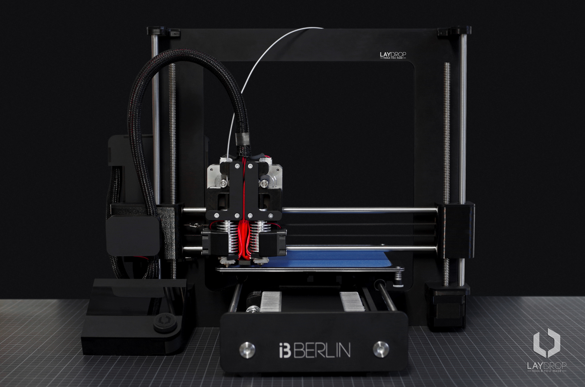

[Next](https://github.com/laydrop/i3_Berlin/wiki/Section-1.2-Tools-and-Parts)

[Section Menu](https://github.com/laydrop/i3_Berlin/wiki/Section-1-Introduction)

It all started with [Adrian Bowyer](http://adrianbowyer.net/), professor at the university of Bath in the UK. He felt inspired by a much older idea of the universal constructor, a theoretical machine by the mathematician [John von Nuemann](http://en.wikipedia.org/wiki/Von_Neumann_universal_constructor) just after WW2. This machine could reproduce itself and look for it´s own raw materials and take care of it´s own transport. Bowyer´s machine didn´t have to be that complicated, if it could only make half of it´s own parts it would already be a breakthrough.

<table>
<colgroup>
<col width="100%" />
</colgroup>
<tbody>
<tr class="odd">
<td align="left">
 
 Adrian Bowyer
</td>
</tr>
</tbody>
</table>

In the year 2004 he wrote down this idea in his manifesto: [“wealth without money”](http://reprap.org/wiki/Wealth_Without_Money). He called the project RepRap, which stands for self-REPlicating RAPid prototyper. He decided that this project should evolve like nature, which is based on the free multiplication of information.

These ideas inspired many around the globe, but it still took until the year 2008 before the first working RepRap actually became a mother of the next RepRap.

<table>
<colgroup>
<col width="100%" />
</colgroup>
<tbody>
<tr class="odd">
<td align="left">
 
 RepRap Darwin
</td>
</tr>
</tbody>
</table>

This first machine was called the Darwin, and was a difficult to build and difficult to operate piece of machinery. It worked, but could also be improved.

<table>
<colgroup>
<col width="100%" />
</colgroup>
<tbody>
<tr class="odd">
<td align="left">
 
 RepRap Mendel
</td>
</tr>
</tbody>
</table>

The first improvements came from Bowyers own lab in the shape of the Mendel. This was a much better machine, but still difficult to build, and that is where a young enthusiast from Prague came on the stage.

<table>
<colgroup>
<col width="100%" />
</colgroup>
<tbody>
<tr class="odd">
<td align="left">
 
 Prusa Mendel
</td>
</tr>
</tbody>
</table>

His name Josef Prusa and redesigned the Mendel into the Prusa-Mendel, a much easier to build machine. And therefore much more accessible. Thousands of people build this open source machine. The software improved, as well as the electronics. A hole RepRap economy started growing and many other people started making their own printer designs.

<table>
<colgroup>
<col width="100%" />
</colgroup>
<tbody>
<tr class="odd">
<td align="left">
 
 Prusa i3
</td>
</tr>
</tbody>
</table>

In 2012 Prusa did it again and made a complete new 3D printer design, which was even easier to build. He called it the Prusa i3, which stands for “iteration 3”

We, as Open 3d Engineering started to host workshops in building the Prusa i3 in our hometown Berlin. After 50 printers build we decided to pimp up the Prusa i3, our design is called the i3 Berlin. This is the printer that we will build in this video. We believe that this is an even easier to build desktop 3D printer, and of course it is completely open source.

<table>
<colgroup>
<col width="100%" />
</colgroup>
<tbody>
<tr class="odd">
<td align="left">

</td>
</tr>
</tbody>
</table>

We, nor Josef Prusa, nor Adrian Bowyer could have done anything without the vibrant RepRap community. We like to end this little history lesson to thank the RepRap community on the IRC and on the reprap.org website. The fantastic blogs of [RichRap](http://richrap.blogspot.de/) and [Nophead](http://hydraraptor.blogspot.de/). The editors of the [Reprap magazine](http://reprapmagazine.com/). And most of all the software developers like [Kliment Yanev](https://www.youtube.com/watch?v=sr-ASAqxiJg), [Alessandro Ranellucci](http://slic3r.org/), [Erik van der Zalm](http://reprap.org/wiki/Marlin), the Arduino community and many many others. Thank you!

[Next](https://github.com/laydrop/i3_Berlin/wiki/Section-1.2-Tools-and-Parts)
