[Next](https://github.com/laydrop/i3-Berlin/wiki/Section-1.3-Preparing-Casings)

   
| tools | description |
|-------|-------------|
|  | Laptop with OSX, Linux or Windows |
|  | Open End Spanners sized 17mm/15mm/8mm |
|  | Torx 8 Screwdriver |
|  | Allen keys 1.5, 2.5, 3.0 and 6.0 mm |
|  | Utility Knive |
|  | Long Nose Pliers |
|  | Clipping Pliers |
|  | Calipers |
|  | Zap Goo PT12 or UHU Allplast |
|  | Scotch Blue Tape _*_ |
|  | Kapton _*_ |
*\** Included in the Workshop, NOT included in the Kit.
   
This is the list of all the parts you will find in the box if you bought a kit or workshop through [Laydrop](http://www.laydrop.com/en/). A full Bill of Materials can be found [here](https://github.com/laydrop/i3-Berlin/blob/master/BOM.csv)
   
Tip: you can enlarge the images by right click and then view the image.
    
    
    
#### Acryl Parts
| 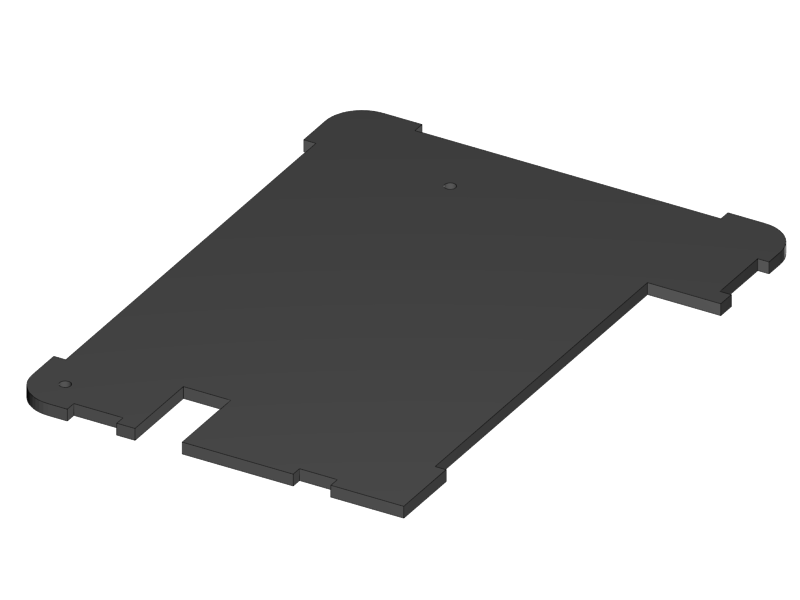 1x RUMBA Case Base | 1x RUMBA Case Bottom |  1x RUMBA Case Left Side |  1x RUMBA Case Top | 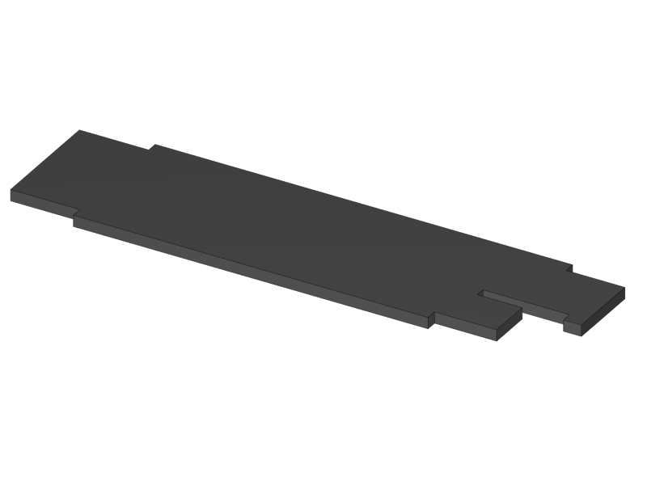 1x RUMBA Case Right Side |
|---|---|---|---|---|
|  1x Case Lid |  1x Display Case Base |  1x Display Case Left | 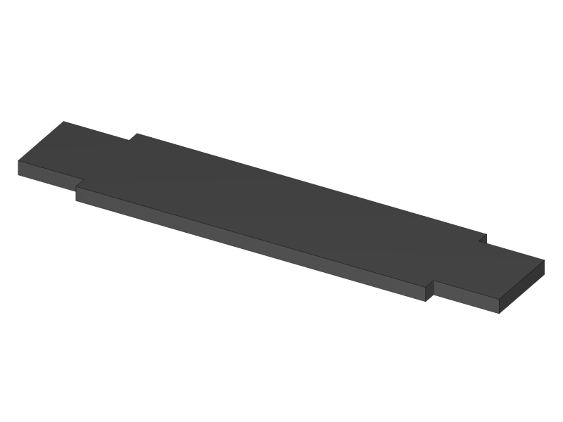 1x Display Case Back |  1x Display Case Front |
| 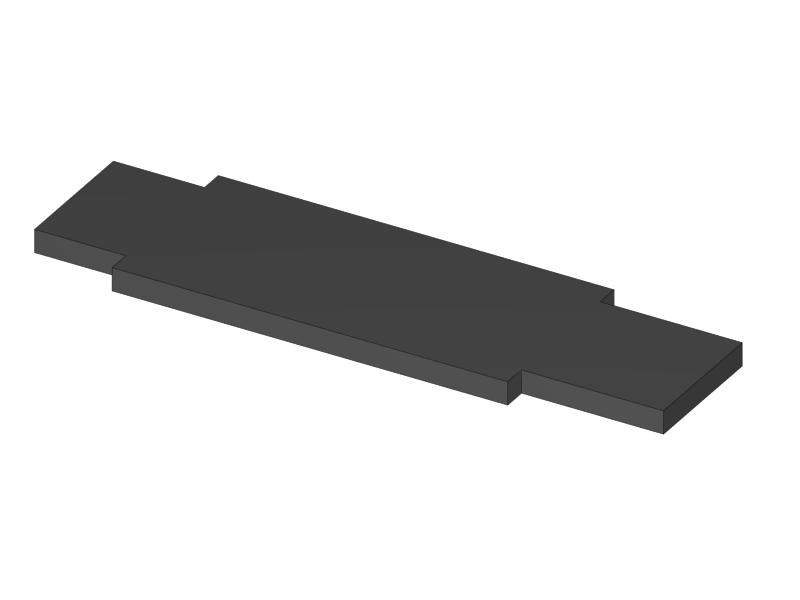 1x Display Case Right | 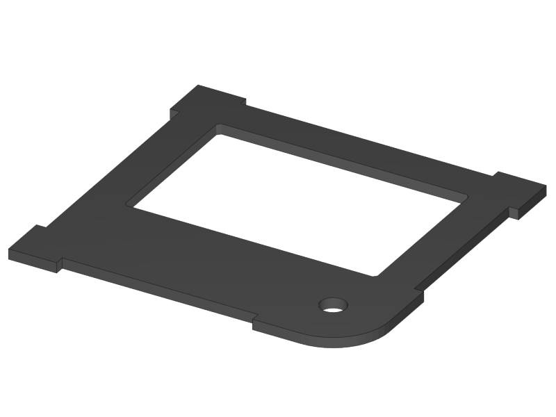 1x Display Case Top Base |  1x Display Case Top Bottom |  1x Display Case Window |  1x Display Case Window |
|  1x Display Case Top |  4x Display spacer |  1x Knob Base |  1x Knob Support |  1x Knob Rim |
|  1x Knob Cushion |  2x Display Case Foot |  3x End-stop Cover Top | 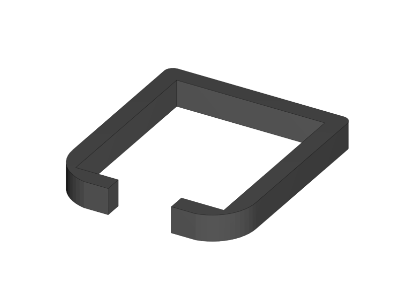 3x End-stop Cover Rim |  1x X-Motor Cover Acrylic |
|  1x X-Idler Cover Acrylic |  2x Z-Motor Cover Acrylic |  2x Z-Top Cover Acrylic |  1x Z-Endstop Holder |  1x Cable Holder Cover | 
|  1x RUMBA Case Inlet Side |  2x X-Idler Cover |  1x RUMBA Case Cable Inlet |  2x RUMBA Case Corner |  1x RUMBA Case FanHolder |
| 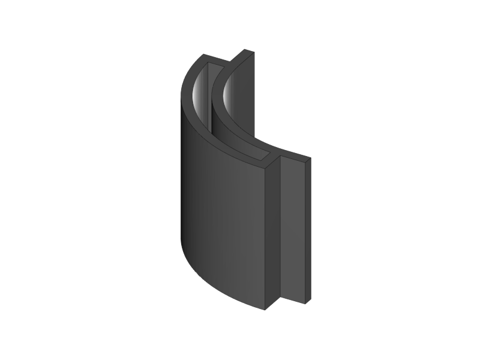 1x Display Case Corner | | | | |
   
   
#### Printed Parts Y
|  1x Y-Middle Right |  1x Y-Middle Left |  1x Y-Front Left |  1x Y-Height Adjuster |  1x Y-Front Right |
|---|---|---|---|---|
| 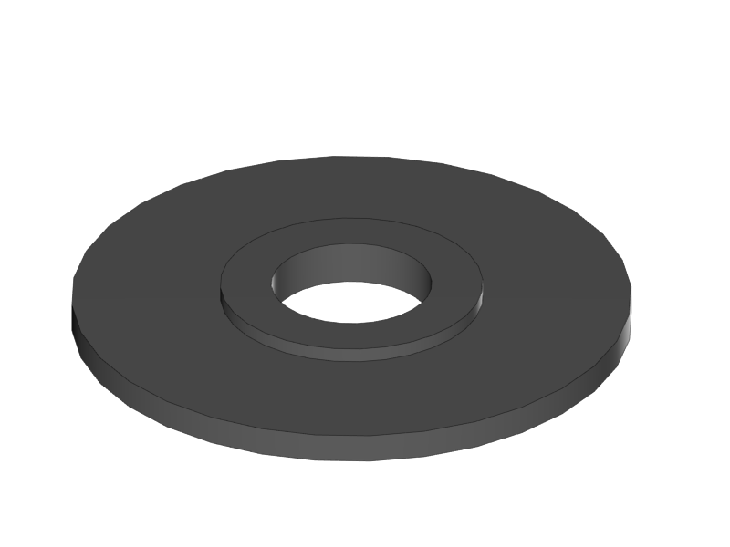 2x Belt Guiding Disk |  1x Y-Motor mount |  1x Power Connector Cover |  1x Y-Back Left |  1x Y-Teeth |
   
   
#### Printed Parts XZ
| 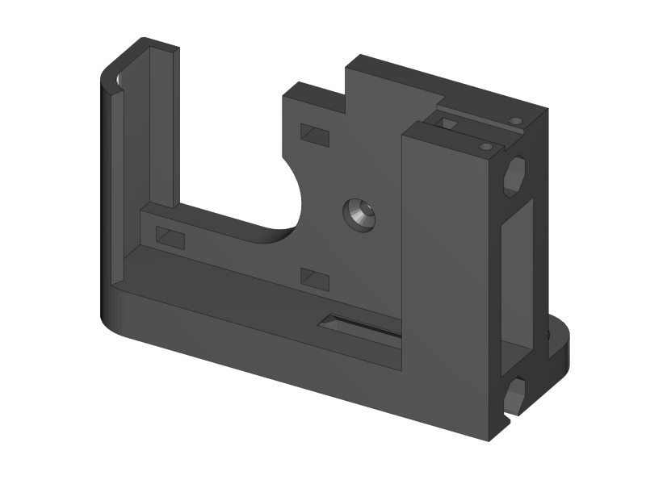 1x X-Motor |  1x X-Bearing Holder Left | 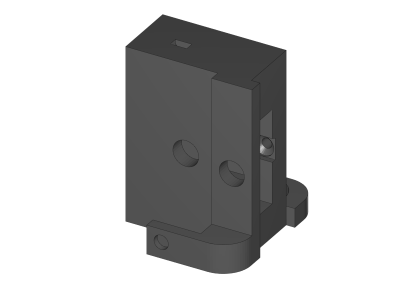 1x X-Idler |  1x X-Bearing Holder Right |  1x X-Carriage |
|---|---|---|---|---|
|  1x X-Teeth |  1x Z-Motor Left |  1x Z-Motor Right |  2x Belt Guiding Disk |  1x Z-Top Left | 
|  1x Z-Top Right | | | | |
   
   
#### Printed Parts Extruder
|  1x Extruder Fan Holder |  1x Extruder Center Left |  1x Extruder Center Right |  2x E3D Fan Duct |  1x Power Supply Cover |
|---|---|---|---|---|
|  1x Active Cooling |  1x Cable Holder |  1x RUMBA Case Small Corner | | |
   
   
#### Frame
|  1x Back Plate |  1x Front Plate |  1x Y-Carriage |  1x XZ-Plate |  1x Extruder Base Plate |
|---|---|---|---|---|
|  1x Extruder Front Plate L |  1x Extruder Front Plate R | | | |
   
   
#### RUMBA Box
|  1x RUMBA Board |  2x GT2 Pulley |  1x 40mm Fan |  4x M3x4 Set Screw |  1x Ceramic Screw Driver | 
|---|---|---|---|---|

   
#### Graphic LCD Box
|  1x Graphic LCD Controller |  1x SD Card |  2x Flatband Cable |   |   | 
|---|---|---|---|---|

   
#### Endstop Box
|  1x Hall-O Endstop |  6x Magnet |  |   |   | 
|---|---|---|---|---|

   
#### Rods Y
|  2x M10 Threaded Rod | 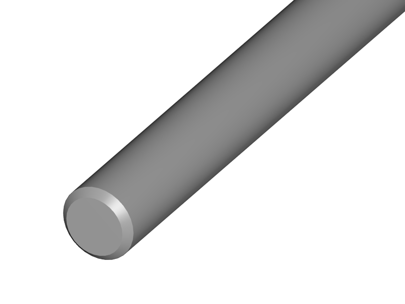 2x Smooth Rod 8 x 385 |   |   |   | 
|---|---|---|---|---|
   
   
#### Rods XZ
|  1x 8mm x 400 Smooth Rod |  1x 8mm x 343 Smooth Rod |  2x 8x320mm Smooth Rod |  2x Nema 17 Threaded Stepper |   |
|---|---|---|---|---|
   
   
#### Screws Y
|  8x M10 Washer |  8x M10 Spring Washer |  12x M10 Nut |  2x M10 Flange Nut |  4x Round Nut |
|---|---|---|---|---|
|  4x M4x10 Cylinder Screw |  1x M3x16 Cylinder Screw | 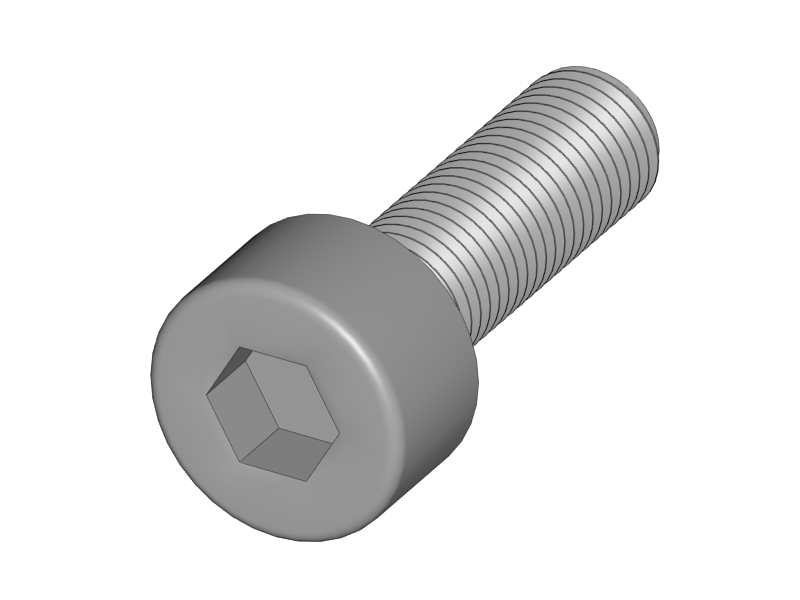 3+1 M3x10 Cylinder Screw | 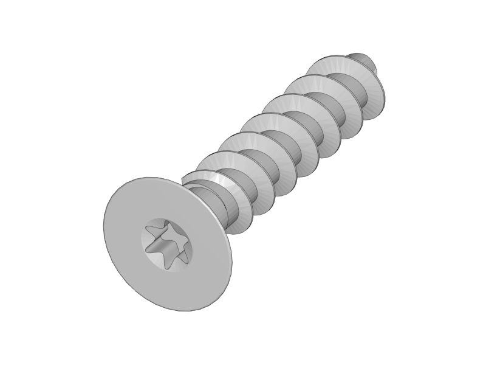 3x Torx 3x16 Screw | 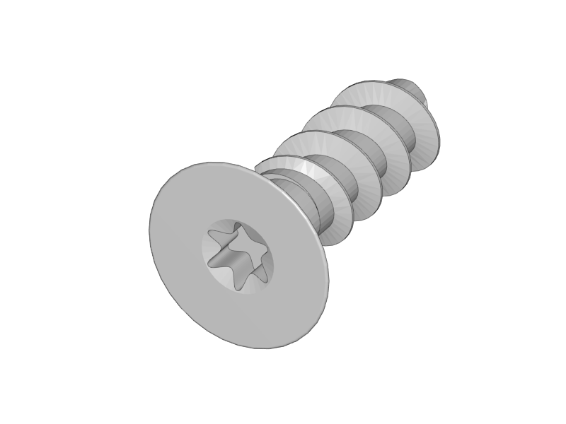 2+1 Torx 3x10 Screw |
|  1+1 M3 Locknut |  1x 4h8x16 Dowel |  1x 624ZZ Bearing |  1x Teethed Washer |  1x Belt Tensioner | 
   
   
#### Screws XZ
|  1x M4x10 Cylinder Screw |  5+1 M3x10 Cylinder Screw |  8+1 M3x10 Counter Sunk |  6x Torx 3x16 Screw |  14+1 Torx 3x10 Screw |
|---|---|---|---|---|
|  5+1 M3 Washer |  1x 624ZZ Bearing |  1x Belt Tensioner | | |
   
   
#### Screws Wiring 
|  2x M3x40 Cylinder Screw |  2x M3x10 Cylinder Screw |  3x M3x20 CounterSunk |  3x M3 Locknut |  3x M3 Knurled Nut |
|---|---|---|---|---|
|  3x Spring |  2x Spacers | | | |
   
   
#### Screws Extruder
|  4x M3x20 Cylinder Screw |  6x M3x20 Counter Sunk |  2x M3x12 Counter Sunk |  8x Torx 3x16 Screw | 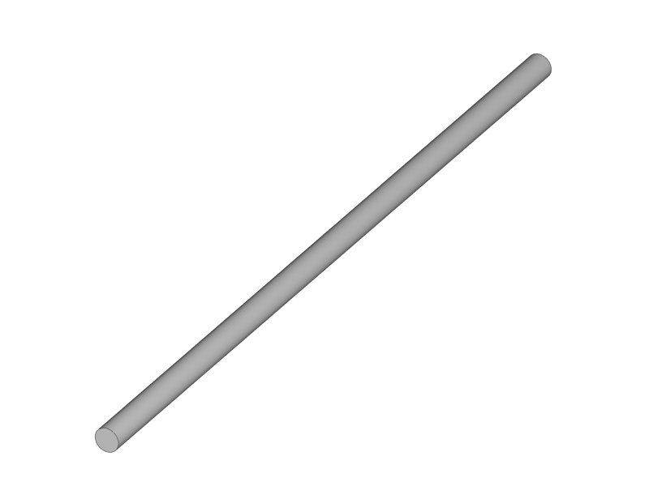 4x Extruder Spring |
|---|---|---|---|---|
|  2x 4h8x16 Dowel |  2x 624ZZ Bearing | | | |
   
   
#### Hotend
|  1x M3x3 Set Screw |  1x M3x4 Set Screw |  1x Filament Pulley |  1x E3D Cooler Body |  1x E3D Heat Break |
|---|---|---|---|---|
|  1x E3D Heater Block |  1x E3D Nozzle |  1x Thermistor |  1x Thermistor insulation 5cm | |
   
   
#### Electronics
|  2x Nema 17 48mm |  1or2 Nema 17 40mm |  1x Power Connector |  2x Glass Fuse |  1x X Endstop 60cm |
|---|---|---|---|---|
|  1x X Motor 53cm |  1x Y Endstop 60cm |  1x Y Motor 55cm |  1x Z Endstop 65cm |  1x Z-Motor Serial |
|  1or2 Extruder Motor 100cm |  1or2 Extruder Thermistor 110cm |  1or2 Extruder Fan Passive 110cm |  1x Extruder Fan Active 100cm |  1or2 Extruder HeatCartridge 100cm |
|  1x PSU-Power 12V 44cm |  1x PSU-Power 220V 29cm |  1x Timing Belt-X 83,6cm |  1x Timing Belt-Y 72,8cm |  1x Braided Sleeve 39cm |
|  1x Braided Sleeve 54cm |  1x Braided Sleeve 50cm |  1x Braided Sleeve 31cm |  1x Braided Sleeve 74cm |  1x Power Cable |
   
   
#### Filament Holder + Heatbed
|  1x Mirror Clamp |  1x Filament Holder |  4x 624ZZ Bearing |  2x 4mm Rod |  1x Teflon pipe 1m |
|---|---|---|---|---|
|  1x Heatbed |  1x Mirror |  1x Power Supply Sticker | 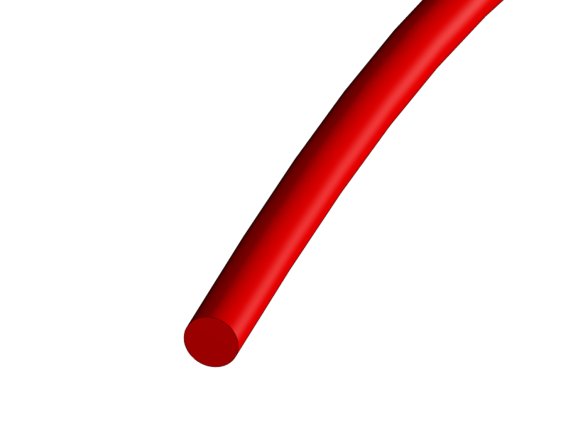 5m Test Filament | |
   
   
#### Other
|  1x Power Supply |  10x LM8UU Linear Bearing |  50x Zipties |  1x superglue |  |
|---|---|---|---|---|

   
[Next](https://github.com/laydrop/i3-Berlin/wiki/Section-1.3-Preparing-Casings)