[Next](https://github.com/laydrop/i3-Berlin/wiki/Section-1.3-Preparing-Casings)

| tools | description |
|-------|-------------|
|  | Laptop with OSX, Linux or Windows |
|  | Open End Spanners sized 17mm/15mm/8mm |
|  | Torx 8 Screwdriver |
|  | Allen keys 1.5, 2.5, 3.0 and 6.0 mm |
|  | Utility Knive |
|  | Long Nose Pliers |
|  | Clipping Pliers |
|  | Calipers |
|  | Zap Goo PT12 or UHU Allplast |
|  | Scotch Blue Tape _*_ |
|  | Kapton _*_ |
*\** Included in the Workshop, NOT included in the Kit.

This is the list of all the parts you will find in the box if you bought a kit or workshop through [Laydrop](http://www.laydrop.com/en/). A full Bill of Materials can be found [here](https://github.com/laydrop/i3-Berlin/blob/master/BOM.csv)

Tip: you can enlarge the images by right click and then view the image.

| Acryl Parts | - | - | - | - | 
|---|---|---|---|---|
|  1x RUMBA Case Base | 1x RUMBA Case Bottom |  1x RUMBA Case Left Side |  1x RUMBA Case Top |  1x RUMBA Case Right Side |
| 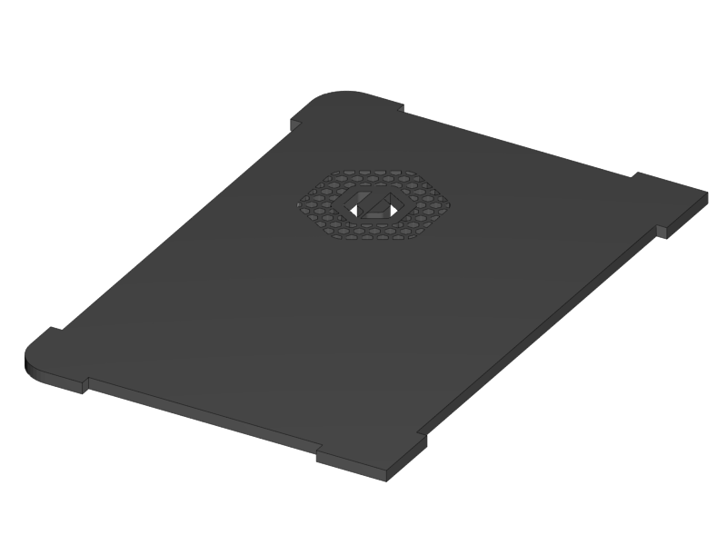 1x Case Lid |  1x Display Case Base |  1x Display Case Left |  1x Display Case Back |  1x Display Case Front |
|  1x Display Case Right |  1x Display Case Top Base |  1x Display Case Top Bottom | 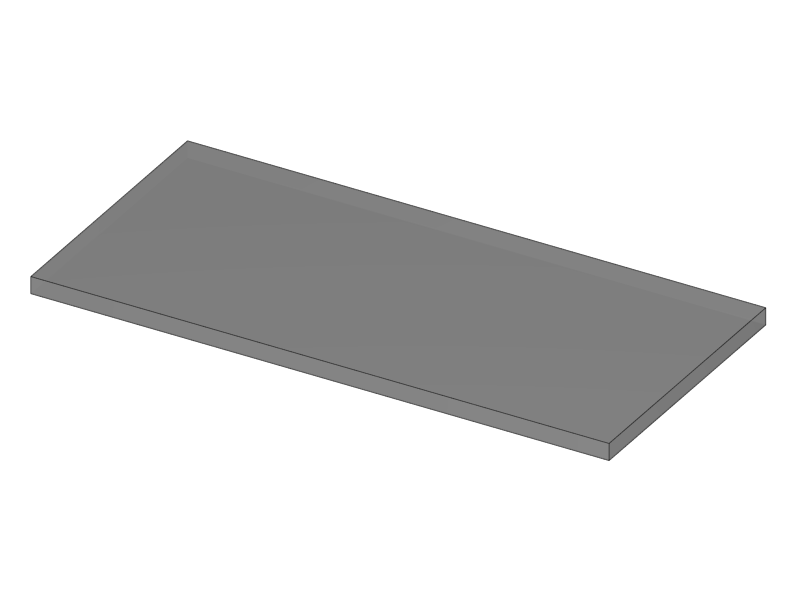 1x Display Case Window |  1x Display Case Window |
|  1x Display Case Top |  4x Display spacer |  1x Knob Base | 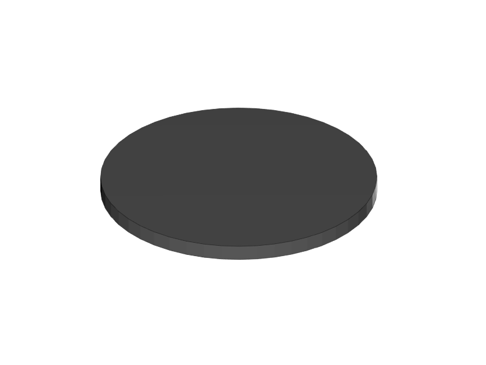 1x Knob Support | 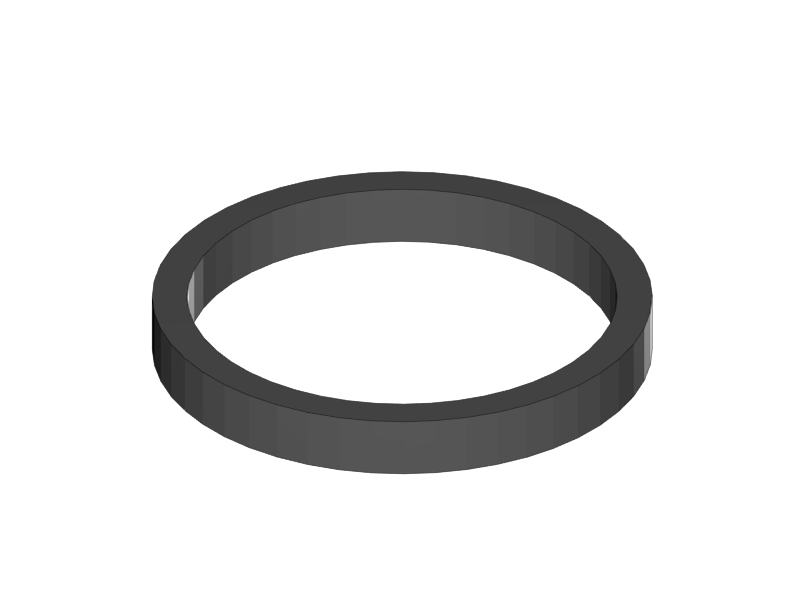 1x Knob Rim |
|  1x Knob Cushion |  2x Display Case Foot |  3x End-stop Cover Top |  3x End-stop Cover Rim |  1x X-Motor Cover Acrylic |
|  1x X-Idler Cover Acrylic |  2x Z-Motor Cover Acrylic |  2x Z-Top Cover Acrylic |  1x Z-Endstop Holder |  1x Cable Holder Cover | 
|  1x RUMBA Case Inlet Side | 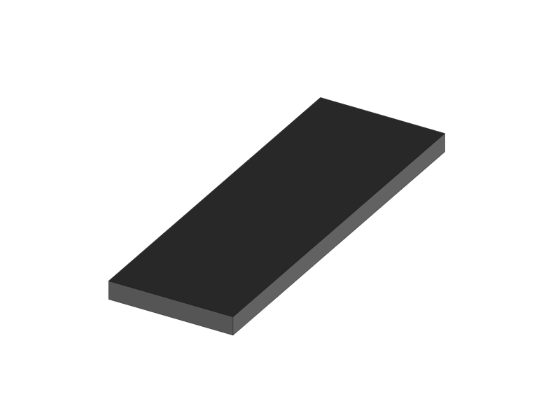 2x X-Idler Cover | 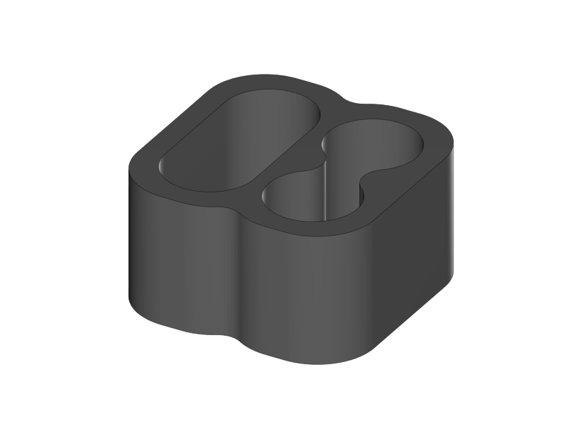 1x RUMBA Case Cable Inlet |  2x RUMBA Case Corner |  1x RUMBA Case FanHolder |
|  1x Display Case Corner | | | | |

<table>
<caption>Printed Parts Y</caption>
<colgroup>
<col width="100%" />
</colgroup>
<tbody>
<tr class="odd">
<td align="left">
□  
 1x Y-Middle Right
</td>
</tr>
<tr class="even">
<td align="left">
□  
 1x Y-Middle Left
</td>
</tr>
<tr class="odd">
<td align="left">
□  
 1x Y-Front Left
</td>
</tr>
<tr class="even">
<td align="left">
□  
 1x Y-Height Adjuster
</td>
</tr>
<tr class="odd">
<td align="left">
□  
 1x Y-Front Right
</td>
</tr>
<tr class="even">
<td align="left">
□  
 2x Belt Guiding Disk
</td>
</tr>
<tr class="odd">
<td align="left">
□  
 1x Y-Motor mount
</td>
</tr>
<tr class="even">
<td align="left">
□ 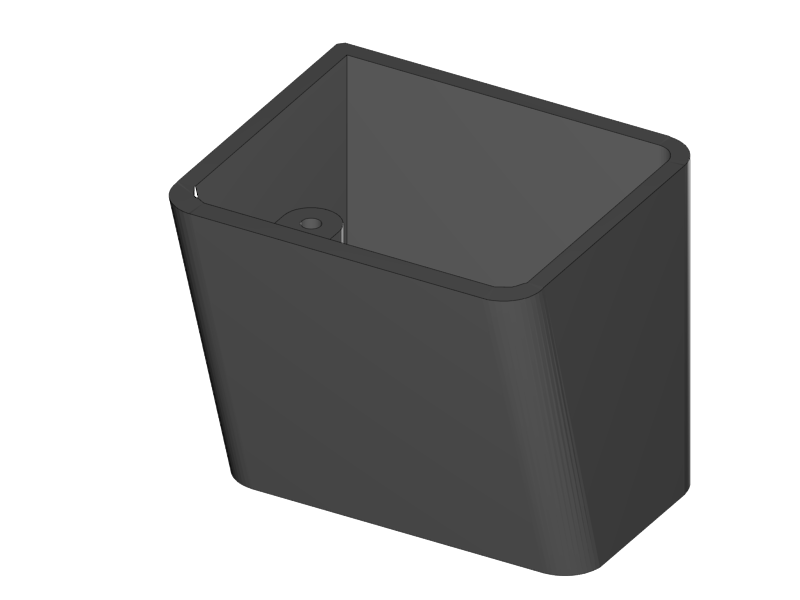 
 1x Power Connector Cover
</td>
</tr>
<tr class="odd">
<td align="left">
□  
 1x Y-Back Left
</td>
</tr>
<tr class="even">
<td align="left">
□  
 1x Y-Teeth
</td>
</tr>
</tbody>
</table>

<table>
<caption>Printed Parts XZ</caption>
<colgroup>
<col width="100%" />
</colgroup>
<tbody>
<tr class="odd">
<td align="left">
□  
 1x X-Motor
</td>
</tr>
<tr class="even">
<td align="left">
□ 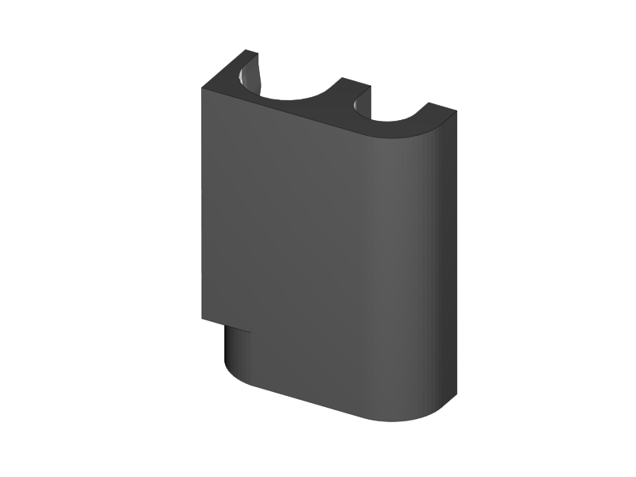 
 1x X-Bearing Holder Left
</td>
</tr>
<tr class="odd">
<td align="left">
□  
 1x X-Idler
</td>
</tr>
<tr class="even">
<td align="left">
□ 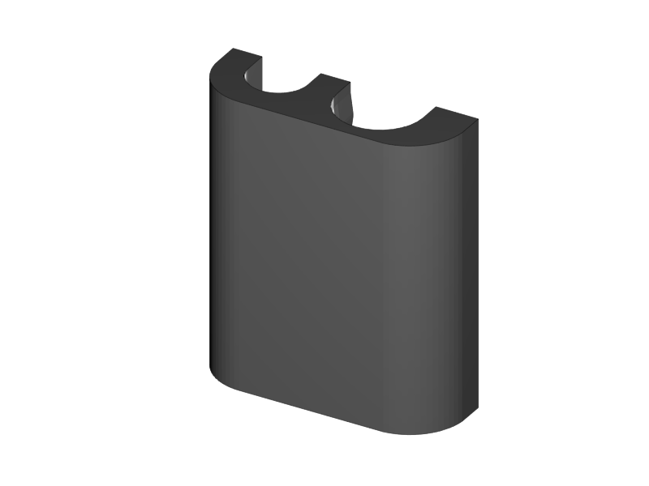 
 1x X-Bearing Holder Right
</td>
</tr>
<tr class="odd">
<td align="left">
□ 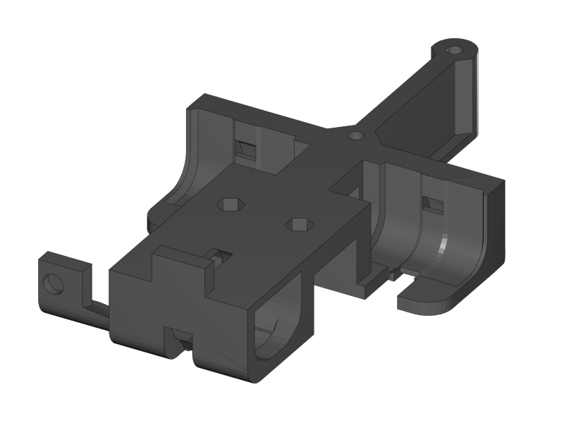 
 1x X-Carriage
</td>
</tr>
<tr class="even">
<td align="left">
□  
 1x X-Teeth
</td>
</tr>
<tr class="odd">
<td align="left">
□  
 1x Z-Motor Left
</td>
</tr>
<tr class="even">
<td align="left">
□  
 1x Z-Motor Right
</td>
</tr>
<tr class="odd">
<td align="left">
□  
 2x Belt Guiding Disk
</td>
</tr>
<tr class="even">
<td align="left">
□  
 1x Z-Top Left
</td>
</tr>
<tr class="odd">
<td align="left">
□  
 1x Z-Top Right
</td>
</tr>
<tr class="even">
<td align="left"></td>
</tr>
<tr class="odd">
<td align="left"></td>
</tr>
<tr class="even">
<td align="left"></td>
</tr>
<tr class="odd">
<td align="left"></td>
</tr>
</tbody>
</table>

<table>
<caption>Printed Parts Extruder</caption>
<colgroup>
<col width="100%" />
</colgroup>
<tbody>
<tr class="odd">
<td align="left">
□  
 1x Extruder Fan Holder
</td>
</tr>
<tr class="even">
<td align="left">
□  
 1x Extruder Center Left
</td>
</tr>
<tr class="odd">
<td align="left">
□  
 1x Extruder Center Right
</td>
</tr>
<tr class="even">
<td align="left">
□  
 2x E3D Fan Duct
</td>
</tr>
<tr class="odd">
<td align="left"></td>
</tr>
</tbody>
</table>

<table>
<caption>Printed Parts Wiring</caption>
<colgroup>
<col width="100%" />
</colgroup>
<tbody>
<tr class="odd">
<td align="left">
□  
 1x Power Supply Cover
</td>
</tr>
<tr class="even">
<td align="left">
□  
 1x Active Cooling
</td>
</tr>
<tr class="odd">
<td align="left">
□  
 1x Cable Holder
</td>
</tr>
<tr class="even">
<td align="left">
□ 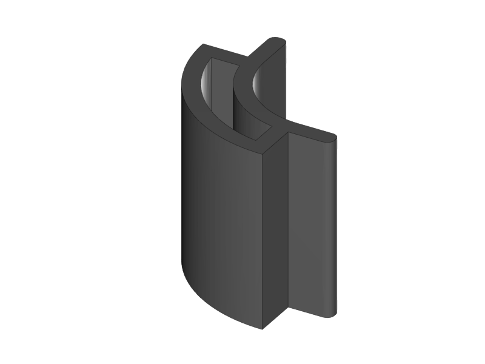 
 1x RUMBA Case Small Corner
</td>
</tr>
</tbody>
</table>

<table>
<caption>Frame</caption>
<colgroup>
<col width="100%" />
</colgroup>
<tbody>
<tr class="odd">
<td align="left">
□  
 1x Back Plate
</td>
</tr>
<tr class="even">
<td align="left">
□  
 1x Front Plate
</td>
</tr>
<tr class="odd">
<td align="left">
□  
 1x Y-Carriage
</td>
</tr>
<tr class="even">
<td align="left">
□  
 1x XZ-Plate
</td>
</tr>
<tr class="odd">
<td align="left">
□  
 1x Extruder Base Plate
</td>
</tr>
<tr class="even">
<td align="left">
□  
 1x Extruder Front Plate L
</td>
</tr>
<tr class="odd">
<td align="left">
□  
 1x Extruder Front Plate R
</td>
</tr>
<tr class="even">
<td align="left"></td>
</tr>
<tr class="odd">
<td align="left"></td>
</tr>
<tr class="even">
<td align="left"></td>
</tr>
</tbody>
</table>

<table>
<caption>RUMBA Box</caption>
<colgroup>
<col width="100%" />
</colgroup>
<tbody>
<tr class="odd">
<td align="left">
□  
 1x RUMBA Board
</td>
</tr>
<tr class="even">
<td align="left">
□ 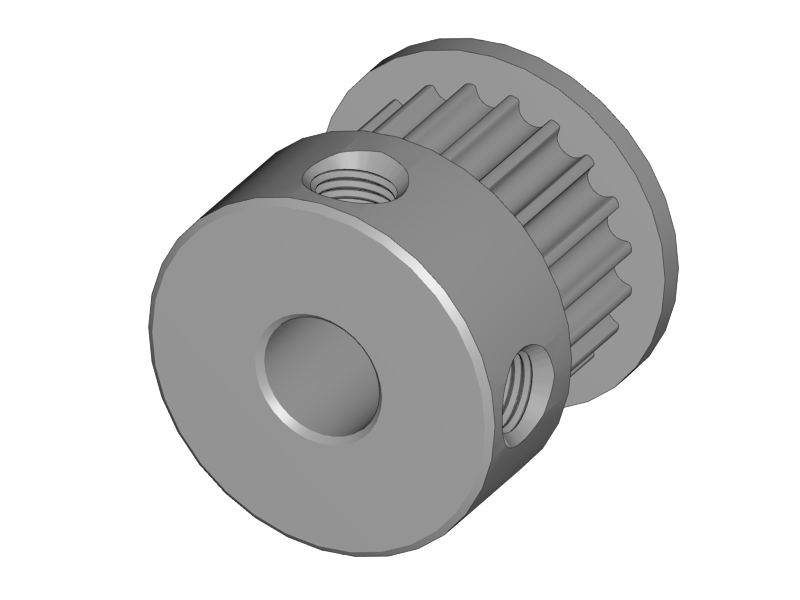 
 2x GT2 Pulley
</td>
</tr>
<tr class="odd">
<td align="left">
□  
 1x 40mm Fan
</td>
</tr>
<tr class="even">
<td align="left">
□  
 4x M3x4 Set Screw
</td>
</tr>
<tr class="odd">
<td align="left">
□  
 1x Ceramic Screw Driver
</td>
</tr>
</tbody>
</table>

<table>
<caption>Graphic LCD Box</caption>
<colgroup>
<col width="100%" />
</colgroup>
<tbody>
<tr class="odd">
<td align="left">
□  
 1x Graphic LCD Controller
</td>
</tr>
<tr class="even">
<td align="left">
□  
 1x SD Card
</td>
</tr>
<tr class="odd">
<td align="left">
□  
 2x Flatband Cable
</td>
</tr>
</tbody>
</table>

<table>
<caption>Endstop Box</caption>
<colgroup>
<col width="100%" />
</colgroup>
<tbody>
<tr class="odd">
<td align="left">
□  
 1x Hall-O Endstop
</td>
</tr>
<tr class="even">
<td align="left">
□  
 6x Magnet
</td>
</tr>
</tbody>
</table>

<table>
<caption>Rods Y</caption>
<colgroup>
<col width="100%" />
</colgroup>
<tbody>
<tr class="odd">
<td align="left">
□  
 2x M10 Threaded Rod
</td>
</tr>
<tr class="even">
<td align="left">
□  
 2x Smooth Rod 8 x 385
</td>
</tr>
</tbody>
</table>

<table>
<caption>Rods XZ</caption>
<colgroup>
<col width="100%" />
</colgroup>
<tbody>
<tr class="odd">
<td align="left">
□  
 1x 8mm x 400 Smooth Rod
</td>
</tr>
<tr class="even">
<td align="left">
□  
 1x 8mm x 343 Smooth Rod
</td>
</tr>
<tr class="odd">
<td align="left">
□  
 2x 8x320mm Smooth Rod
</td>
</tr>
<tr class="even">
<td align="left">
□  
 2x Nema 17 Threaded Stepper
</td>
</tr>
</tbody>
</table>

<table>
<caption>Screws Y</caption>
<colgroup>
<col width="100%" />
</colgroup>
<tbody>
<tr class="odd">
<td align="left">
□  
 8x M10 Washer
</td>
</tr>
<tr class="even">
<td align="left">
□  
 8x M10 Spring Washer
</td>
</tr>
<tr class="odd">
<td align="left">
□  
 12x M10 Nut
</td>
</tr>
<tr class="even">
<td align="left">
□  
 2x M10 Flange Nut
</td>
</tr>
<tr class="odd">
<td align="left">
□  
 4x Round Nut
</td>
</tr>
<tr class="even">
<td align="left">
□  
 4x M4x10 Cylinder Screw
</td>
</tr>
<tr class="odd">
<td align="left">
□  
 1x M3x16 Cylinder Screw
</td>
</tr>
<tr class="even">
<td align="left">
□  
 3+1 M3x10 Cylinder Screw
</td>
</tr>
<tr class="odd">
<td align="left">
□  
 3x Torx 3x16 Screw
</td>
</tr>
<tr class="even">
<td align="left">
□  
 2+1 Torx 3x10 Screw
</td>
</tr>
<tr class="odd">
<td align="left">
□  
 1+1 M3 Locknut
</td>
</tr>
<tr class="even">
<td align="left">
□  
 1x 4h8x16 Dowel
</td>
</tr>
<tr class="odd">
<td align="left">
□  
 1x 624ZZ Bearing
</td>
</tr>
<tr class="even">
<td align="left">
□  
 1x Teethed Washer
</td>
</tr>
<tr class="odd">
<td align="left">
□  
 1x Belt Tensioner
</td>
</tr>
</tbody>
</table>

<table>
<caption>Screws XZ</caption>
<colgroup>
<col width="100%" />
</colgroup>
<tbody>
<tr class="odd">
<td align="left">
□  
 1x M4x10 Cylinder Screw
</td>
</tr>
<tr class="even">
<td align="left">
□  
 5+1 M3x10 Cylinder Screw
</td>
</tr>
<tr class="odd">
<td align="left">
□  
 8+1 M3x10 Counter Sunk
</td>
</tr>
<tr class="even">
<td align="left">
□  
 6x Torx 3x16 Screw
</td>
</tr>
<tr class="odd">
<td align="left">
□  
 14+1 Torx 3x10 Screw
</td>
</tr>
<tr class="even">
<td align="left">
□ 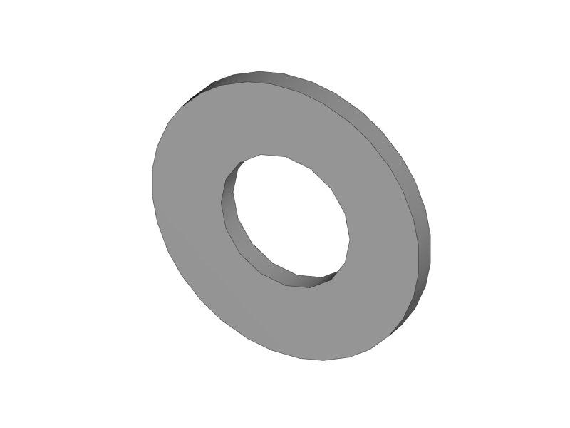 
 5+1 M3 Washer
</td>
</tr>
<tr class="odd">
<td align="left">
□  
 1x 624ZZ Bearing
</td>
</tr>
<tr class="even">
<td align="left">
□  
 1x Belt Tensioner
</td>
</tr>
<tr class="odd">
<td align="left"></td>
</tr>
<tr class="even">
<td align="left"></td>
</tr>
</tbody>
</table>

<table>
<caption>Screws Wiring</caption>
<colgroup>
<col width="100%" />
</colgroup>
<tbody>
<tr class="odd">
<td align="left">
□ 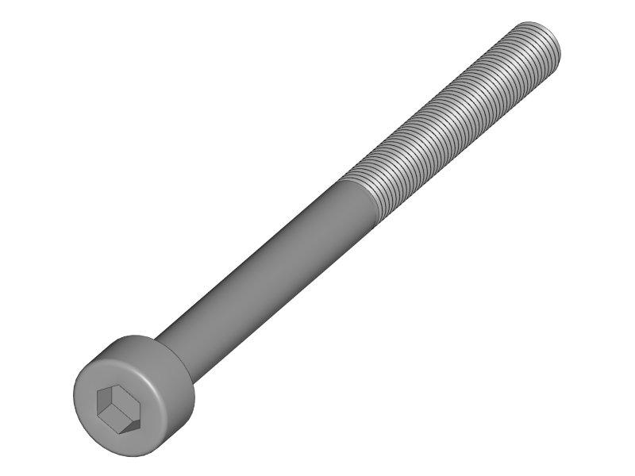 
 2x M3x40 Cylinder Screw
</td>
</tr>
<tr class="even">
<td align="left">
□  
 2x M3x10 Cylinder Screw
</td>
</tr>
<tr class="odd">
<td align="left">
□  
 3x M3x20 CounterSunk
</td>
</tr>
<tr class="even">
<td align="left">
□  
 3x M3 Locknut
</td>
</tr>
<tr class="odd">
<td align="left">
□  
 3x M3 Knurled Nut
</td>
</tr>
<tr class="even">
<td align="left">
□  
 3x Spring
</td>
</tr>
<tr class="odd">
<td align="left">
□  
 2x Spacers
</td>
</tr>
<tr class="even">
<td align="left"></td>
</tr>
<tr class="odd">
<td align="left"></td>
</tr>
<tr class="even">
<td align="left"></td>
</tr>
</tbody>
</table>

<table>
<caption>Screws Extruder</caption>
<colgroup>
<col width="100%" />
</colgroup>
<tbody>
<tr class="odd">
<td align="left">
□  
 4x M3x20 Cylinder Screw
</td>
</tr>
<tr class="even">
<td align="left">
□  
 6x M3x20 Counter Sunk
</td>
</tr>
<tr class="odd">
<td align="left">
□  
 2x M3x12 Counter Sunk
</td>
</tr>
<tr class="even">
<td align="left">
□  
 8x Torx 3x16 Screw
</td>
</tr>
<tr class="odd">
<td align="left">
□  
 4x Extruder Spring
</td>
</tr>
<tr class="even">
<td align="left">
□  
 2x 4h8x16 Dowel
</td>
</tr>
<tr class="odd">
<td align="left">
□  
 2x 624ZZ Bearing
</td>
</tr>
<tr class="even">
<td align="left"></td>
</tr>
<tr class="odd">
<td align="left"></td>
</tr>
<tr class="even">
<td align="left"></td>
</tr>
</tbody>
</table>

<table>
<caption>Hotend</caption>
<colgroup>
<col width="100%" />
</colgroup>
<tbody>
<tr class="odd">
<td align="left">
□  
 1x M3x3 Set Screw
</td>
</tr>
<tr class="even">
<td align="left">
□  
 1x M3x4 Set Screw
</td>
</tr>
<tr class="odd">
<td align="left">
□  
 1x Filament Pulley
</td>
</tr>
<tr class="even">
<td align="left">
□  
 1x E3D Cooler Body
</td>
</tr>
<tr class="odd">
<td align="left">
□  
 1x E3D Heat Break
</td>
</tr>
<tr class="even">
<td align="left">
□  
 1x E3D Heater Block
</td>
</tr>
<tr class="odd">
<td align="left">
□  
 1x E3D Nozzle
</td>
</tr>
<tr class="even">
<td align="left">
□  
 1x Thermistor
</td>
</tr>
<tr class="odd">
<td align="left">
□  
 1x Thermistor insulation 5cm
</td>
</tr>
<tr class="even">
<td align="left"></td>
</tr>
</tbody>
</table>

<table>
<caption>Electronics</caption>
<colgroup>
<col width="100%" />
</colgroup>
<tbody>
<tr class="odd">
<td align="left">
□ 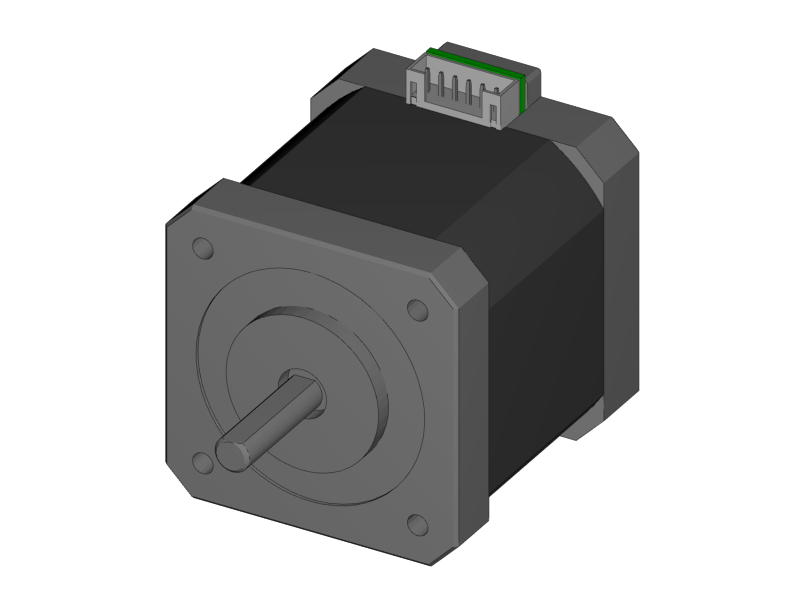 
 2x Nema 17 48mm
</td>
</tr>
<tr class="even">
<td align="left">
□  
 1or2 Nema 17 40mm
</td>
</tr>
<tr class="odd">
<td align="left">
□  
 1x Power Connector
</td>
</tr>
<tr class="even">
<td align="left">
□  
 2x Glass Fuse
</td>
</tr>
<tr class="odd">
<td align="left"></td>
</tr>
</tbody>
</table>

<table>
<caption>Cables</caption>
<colgroup>
<col width="100%" />
</colgroup>
<tbody>
<tr class="odd">
<td align="left">
□  
 1x X Endstop 60cm
</td>
</tr>
<tr class="even">
<td align="left">
□  
 1x X Motor 53cm
</td>
</tr>
<tr class="odd">
<td align="left">
□  
 1x Y Endstop 60cm
</td>
</tr>
<tr class="even">
<td align="left">
□  
 1x Y Motor 55cm
</td>
</tr>
<tr class="odd">
<td align="left">
□  
 1x Z Endstop 65cm
</td>
</tr>
<tr class="even">
<td align="left">
□  
 1x Z-Motor Serial
</td>
</tr>
<tr class="odd">
<td align="left">
□  
 1or2 Extruder Motor 100cm
</td>
</tr>
<tr class="even">
<td align="left">
□  
 1or2 Extruder Thermistor 110cm
</td>
</tr>
<tr class="odd">
<td align="left">
□  
 1or2 Extruder Fan Passive 110cm
</td>
</tr>
<tr class="even">
<td align="left">
□  
 1x Extruder Fan Active 100cm
</td>
</tr>
<tr class="odd">
<td align="left">
□  
 1or2 Extruder HeatCartridge 100cm
</td>
</tr>
<tr class="even">
<td align="left">
□  
 1x PSU-Power 12V 44cm
</td>
</tr>
<tr class="odd">
<td align="left">
□  
 1x PSU-Power 220V 29cm
</td>
</tr>
<tr class="even">
<td align="left">
□  
 1x Timing Belt-X 83,6cm
</td>
</tr>
<tr class="odd">
<td align="left">
□  
 1x Timing Belt-Y 72,8cm
</td>
</tr>
<tr class="even">
<td align="left">
□  
 1x Braided Sleeve 39cm
</td>
</tr>
<tr class="odd">
<td align="left">
□  
 1x Braided Sleeve 54cm
</td>
</tr>
<tr class="even">
<td align="left">
□  
 1x Braided Sleeve 50cm
</td>
</tr>
<tr class="odd">
<td align="left">
□  
 1x Braided Sleeve 31cm
</td>
</tr>
<tr class="even">
<td align="left">
□  
 1x Braided Sleeve 74cm
</td>
</tr>
<tr class="odd">
<td align="left">
□  
 1x Power Cable
</td>
</tr>
<tr class="even">
<td align="left"></td>
</tr>
<tr class="odd">
<td align="left"></td>
</tr>
<tr class="even">
<td align="left"></td>
</tr>
<tr class="odd">
<td align="left"></td>
</tr>
</tbody>
</table>

<table>
<caption>Filament Holder + Heatbed</caption>
<colgroup>
<col width="100%" />
</colgroup>
<tbody>
<tr class="odd">
<td align="left">
□  
 1x Mirror Clamp
</td>
</tr>
<tr class="even">
<td align="left">
□  
 1x Filament Holder
</td>
</tr>
<tr class="odd">
<td align="left">
□  
 4x 624ZZ Bearing
</td>
</tr>
<tr class="even">
<td align="left">
□  
 2x 4mm Rod
</td>
</tr>
<tr class="odd">
<td align="left">
□  
 1x Teflon pipe 1m
</td>
</tr>
<tr class="even">
<td align="left">
□  
 1x Heatbed
</td>
</tr>
<tr class="odd">
<td align="left">
□ 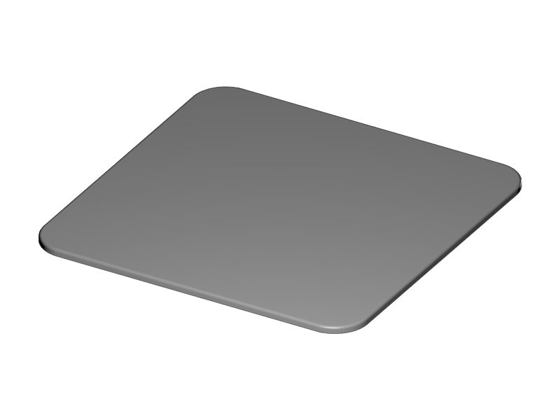 
 1x Mirror
</td>
</tr>
<tr class="even">
<td align="left">
□  
 1x Power Supply Sticker
</td>
</tr>
<tr class="odd">
<td align="left">
□  
 5m Test Filament
</td>
</tr>
<tr class="even">
<td align="left"></td>
</tr>
</tbody>
</table>

<table>
<caption>Other</caption>
<colgroup>
<col width="100%" />
</colgroup>
<tbody>
<tr class="odd">
<td align="left">
□  
 1x Power Supply
</td>
</tr>
<tr class="even">
<td align="left">
□ 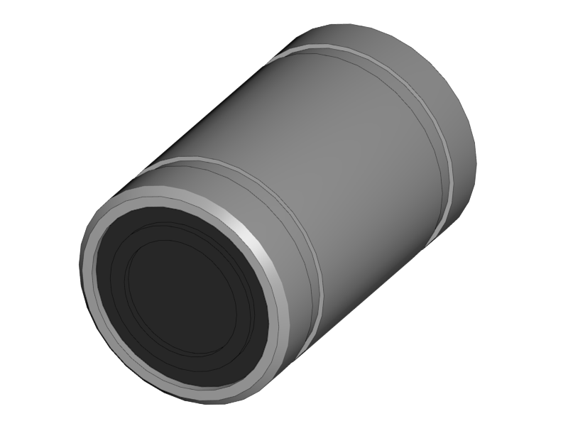 
 10x LM8UU Linear Bearing
</td>
</tr>
<tr class="odd">
<td align="left">
□ 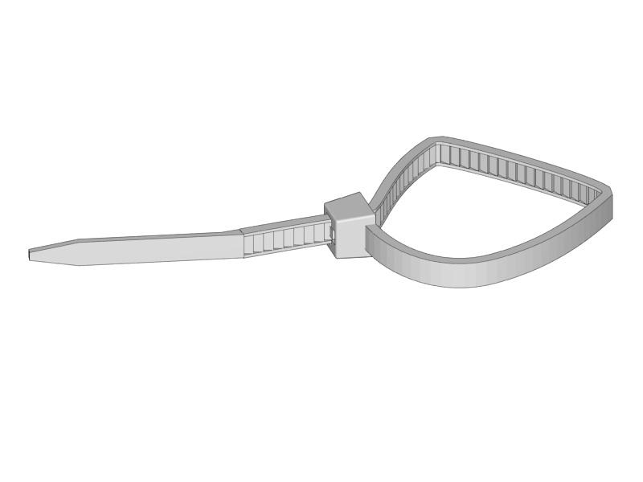 
 50x Zipties
</td>
</tr>
<tr class="even">
<td align="left">
□  
 1x superglue
</td>
</tr>
</tbody>
</table>

[Next](https://github.com/laydrop/i3-Berlin/wiki/Section-1.3-Preparing-Casings)