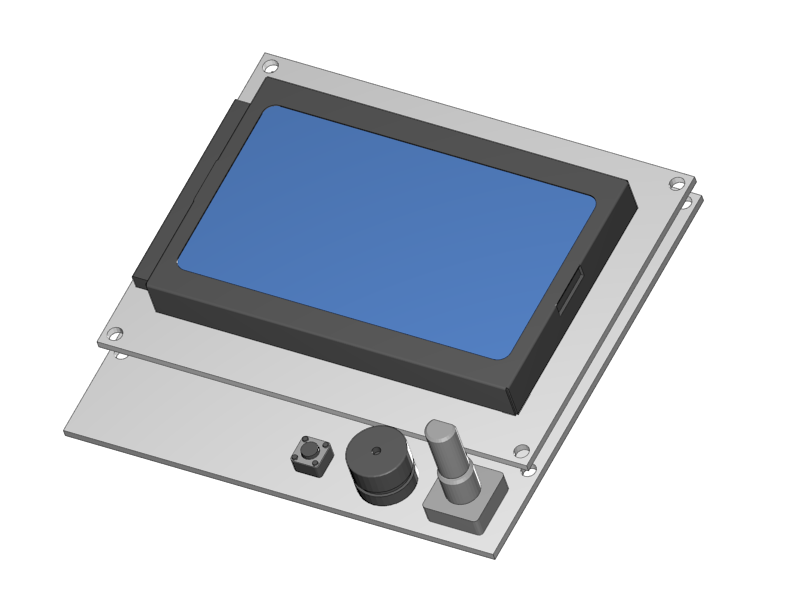

[Next](https://github.com/laydrop/i3-Berlin/wiki/Section-2-Assembly-of-the-Y-Unit)

[Section Menu](https://github.com/laydrop/i3-Berlin/wiki/Section-1-Introduction)

<table>
<tbody>
<tr class="odd">
<td align="left" width="60%">

</td>
<td align="left">
You will start the assembly with glueing the casings for the RUMBA controller electronics and the display. Since the glue needs time to dry it’s to best to have this done now.
</td>
</tr>
</tbody>
</table>

__Please don’t use superglue for acrylic and printed parts, it will result in ugly white stains.__

<table>
<colgroup>
  <col width="20%" />
  <col width="20%" />
  <col width="20%" />
  <col width="20%" />
  <col width="20%" />
</colgroup>
<tbody>
<tr class="odd">
<td align="left">
 
 1x RUMBA Case Bottom
</td>
<td align="left">
 
 1x RUMBA Case Cable Inlet
</td>
<td> </td>
<td> </td>
<td> </td>
</tr>
<tr class="even">
<td colspan="3" align="left">

</td>
<td colspan="2" >
<ul>
  <li> Look for the RUMBA Case Bottom part in the bag of acrylic parts. </li>
  <ul>
    <li> Remove the protective film on the shiny side of the acrylic. </li>
  </ul>
  <li> The Cable Inlet can be found in the bag of printed parts. </li>
  <li> Stick the parts together in such a way that the printed part is flush with the engraved side of the acrylic part. </li>
  <li> If the parts are not fixed well, apply some plastic glue in the corners. </li>
  <ul>
    <li> Mind that the matt side of the acrylic is going to be the visual outside of the casing, so prevent glue stains here. </li>
  </ul>
</ul>
</td>
</tr>
</tbody>
</table>

<table>
<colgroup>
<col width="50%" />
<col width="50%" />
</colgroup>
<tbody>
<tr class="odd">
<td align="left">

</td>
<td align="left">
 
 1x RUMBA Case Base
</td>
</tr>
<tr class="even">
<td align="left">
 
 1x RUMBA Case Left Side
</td>
</tr>
<tr class="odd">
<td align="left">
 
 1x RUMBA Case Top
</td>
</tr>
</tbody>
</table>

-   Remove the protection film on the shiny side of the acrylic.

    -   Leave the protection film of the matt side in place as much a possible to prevent scratches and glue stains.

-   Connect the parts as shown above with the shiny part on top.

-   Take a good look at the image. Apply a line of glue in such a way that it will always stay inside of the casing to prevent stains.

<table>
<colgroup>
<col width="50%" />
<col width="50%" />
</colgroup>
<tbody>
<tr class="odd">
<td align="left">

</td>
<td align="left">
 
 1x RUMBA Case Right Side
</td>
</tr>
</tbody>
</table>

-   Flip up the 3 sides as shown in the picture above, and push them well in place.

-   Prepare a line of glue on the two left corners.

-   Remove the protective film of the acrylic parts.

-   Push in the small piece as shown.

    -   Apply glue if necessary.

-   Put 3 lines of glue on the shiny side of the big part as preparation.

<table>
<colgroup>
<col width="50%" />
<col width="50%" />
</colgroup>
<tbody>
<tr class="odd">
<td align="left">

</td>
<td align="left">
 
 2x RUMBA Case Corner
</td>
</tr>
</tbody>
</table>

-   Put the Rigt Side of the case into position

    -   It’s done easiest to put the lower corner first and turn in the part in counter clockwise direction looking from the top.

-   Slide in the 3D printed corners.

-   Put extra glue into all the corners to secure strength.

-   Fix all the parts with some tape where needed and leave it to dry.

<table>
<colgroup>
<col width="50%" />
<col width="50%" />
</colgroup>
<tbody>
<tr class="odd">
<td align="left">

</td>
<td align="left">
 
 1x RUMBA Case Lid
</td>
</tr>
<tr class="even">
<td align="left">
 
 1x RUMBA Case FanHolder
</td>
</tr>
<tr class="odd">
<td align="left">
 
 1x 40mm Fan
</td>
</tr>
</tbody>
</table>

-   Glue the FanHolder on the shiny side of the RUMBA Case Lid.

    -   Putting the fan first helps aliging the position of the fan holder

    -   Note that the fan should NOT be glued to anything

    -   The fan can be found in the box of the RAMPS electronics

    -   Putting the sticker of the fan towards the outlet is recommended. Like that it will suck out are from the casing instead of blowing it in. An airstream like this reduces dust accumulations.

    -   You can leave the fan.

-   The casing is now finished. The remaining parts will be glued later in the wiring section.

<table>
<colgroup>
<col width="50%" />
<col width="50%" />
</colgroup>
<tbody>
<tr class="odd">
<td align="left">

</td>
<td align="left">
 
 1x Display Case Base
</td>
</tr>
<tr class="even">
<td align="left">
 
 1x Display Case Left
</td>
</tr>
<tr class="odd">
<td align="left">
 
 1x Display Case Back
</td>
</tr>
<tr class="even">
<td align="left">
 
 1x Display Case Front
</td>
</tr>
<tr class="odd">
<td align="left">
 
 1x Display Case Right
</td>
</tr>
</tbody>
</table>

-   Remove the protective film from the shiny side of the acrylic parts.

    -   It’s best to leave the protective film on the matt side.

-   Put them together as shown above.

-   Apply a line of glue on the exact place as shown above.

<table>
<colgroup>
<col width="50%" />
<col width="50%" />
</colgroup>
<tbody>
<tr class="odd">
<td align="left">

</td>
<td align="left">
 
 1x Display Case Corner
</td>
</tr>
</tbody>
</table>

-   Flip up the sides.

-   Put in the corner and glue it

-   Apply some extra glue in the inner corners of the case to secure strength

-   Put tape where needed and let the case dry.

<table>
<colgroup>
<col width="50%" />
<col width="50%" />
</colgroup>
<tbody>
<tr class="odd">
<td align="left">

</td>
<td align="left">
 
 1x Display Case Top Base
</td>
</tr>
<tr class="even">
<td align="left">
 
 1x Display Case Top Bottom
</td>
</tr>
</tbody>
</table>

-   Remove all the protective films, but leave the film on the matt side of the Top Bottom part.

-   Glue the two parts together, take care of alignment.

<table>
<colgroup>
<col width="50%" />
<col width="50%" />
</colgroup>
<tbody>
<tr class="odd">
<td align="left">

</td>
<td align="left">
 
 1x Display Case Window
</td>
</tr>
<tr class="even">
<td align="left">
 
 1x Display Case Top
</td>
</tr>
</tbody>
</table>

-   Remove only the protective film from the shiny side of the top part

-   Put the window part without glueing it.

-   Glue the top part to the base, take care of the alignment.

-   Remove the protective film from one side of the window part and glue it to the base.

-   Double check alignment of all the parts and leave it to dry.

<table>
<colgroup>
<col width="50%" />
<col width="50%" />
</colgroup>
<tbody>
<tr class="odd">
<td align="left">

</td>
<td align="left">
 
 1x Graphic LCD Controller
</td>
</tr>
<tr class="even">
<td align="left">
 
 4x Display spacer
</td>
</tr>
</tbody>
</table>

-   The following steps should only be done when the glue is dry, some hours after the previous step.

-   Put the Display Spacers onto the display.

-   Slide the Display into the casing as shown below.

-   Close the casing with the lid, but don’t glue it.

<table>
<colgroup>
<col width="100%" />
</colgroup>
<tbody>
<tr class="odd">
<td align="left">

</td>
</tr>
</tbody>
</table>

<table>
<colgroup>
<col width="50%" />
<col width="50%" />
</colgroup>
<tbody>
<tr class="odd">
<td align="left">

</td>
<td align="left">
 
 1x Knob Base
</td>
</tr>
<tr class="even">
<td align="left">
 
 1x Knob Support
</td>
</tr>
<tr class="odd">
<td align="left">
 
 1x Knob Rim
</td>
</tr>
<tr class="even">
<td align="left">
 
 1x Knob Cushion
</td>
</tr>
</tbody>
</table>

-   Put the Rim onto the Base and apply some little drips of 1 second super glue to the inner corner.

    -   Make sure that you don’t leave glue stains

-   Glue the Support to the Base with some drips of 1 second super glue

-   Glue the Cushion to the Support with super glue.

<table>
<colgroup>
<col width="50%" />
<col width="50%" />
</colgroup>
<tbody>
<tr class="odd">
<td align="left">

</td>
<td align="left">
 
 2x Display Case Foot
</td>
</tr>
</tbody>
</table>

-   Push the Knob onto the shaft of the Display Controller.

-   Push the feet into the casing. Apply plastic glue if necessary.

That’s it for this section. In the next section you will start mounting the Y-Axis.

[Next](https://github.com/laydrop/i3-Berlin/wiki/Section-2-Assembly-of-the-Y-Unit)
