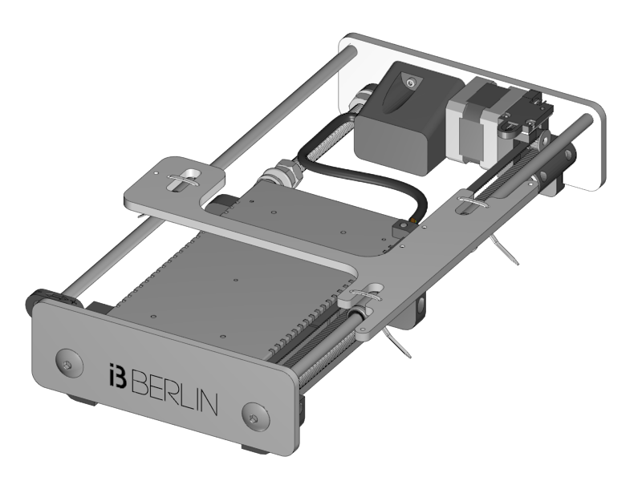

[Next Section](https://github.com/laydrop/i3-Berlin/wiki/Section-3-Assembly-of-the-XZ-Unit)

<table>
<colgroup>
<col width="100%" />
</colgroup>
<tbody>
<tr class="odd">
<td align="left">

</td>
</tr>
</tbody>
</table>

This is what you will build in this section. It is the Unit that moves the print plat form, also known as the Y-Movement. Below the steps for building it.

[Section 2.1](https://github.com/laydrop/i3-Berlin/wiki/Section-2.1-Assembly-of-the-Y-Unit-Mounting-the-threaded-Rods-and-Power-Supply): Mounting the Threaded Rods and Power Supply

[Section 2.2](https://github.com/laydrop/i3-Berlin/wiki/Section-2.2-Assembly-of-the-Y-Unit-Mounting-the-Front-and-Back-Plate): Mounting the Front- and Back- Plate

[Section 2.3](https://github.com/laydrop/i3-Berlin/wiki/Section-2.3-Assembly-of-the-Y-Unit-Mounting-the-Y-Carriage-and-Timing-Belt): Mounting Motor and Y-Carriage

[Next Section](https://github.com/laydrop/i3-Berlin/wiki/Section-3-Assembly-of-the-XZ-Unit)
