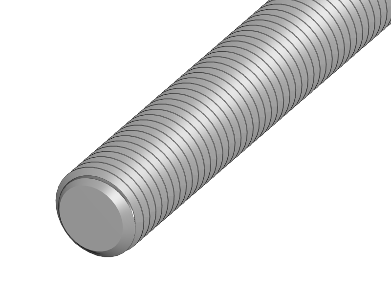
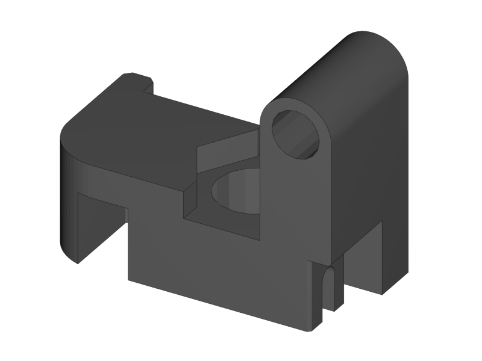
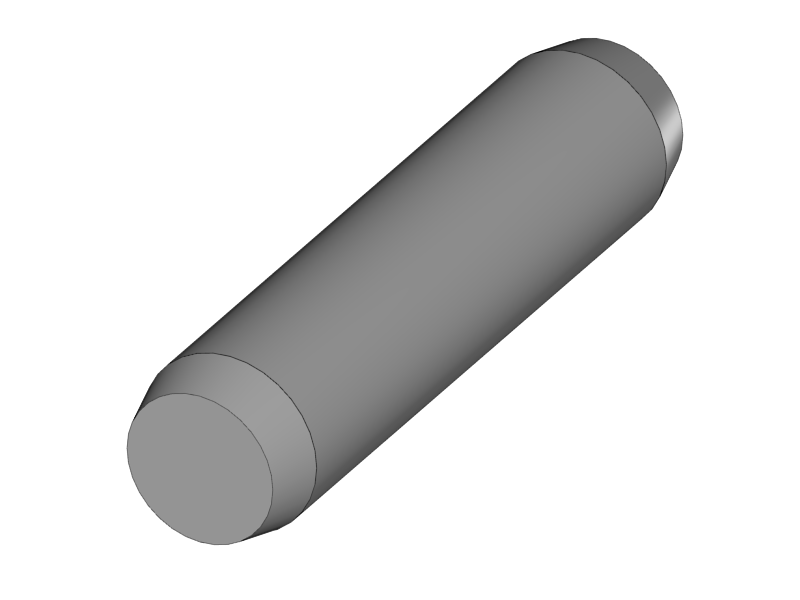

[Next](https://github.com/laydrop/i3-Berlin/wiki/Section-2.2-Assembly-of-the-Y-Unit-Mounting-the-Front-and-Back-Plate)

[Section Menu](https://github.com/laydrop/i3-Berlin/wiki/Section-2-Assembly-of-the-Y-Unit)

<table>
<colgroup>
<col width="50%" />
<col width="50%" />
</colgroup>
<tbody>
<tr class="odd">
<td align="left">

</td>
<td align="left">
 
 1x M10 Threaded Rod
</td>
</tr>
<tr class="even">
<td align="left">
 
 1x Y-Middle Right
</td>
</tr>
<tr class="odd">
<td align="left">
 
 2x M10 Washer
</td>
</tr>
<tr class="even">
<td align="left">
 
 2x M10 Spring Washer
</td>
</tr>
<tr class="odd">
<td align="left">
 
 2x M10 Nut
</td>
</tr>
</tbody>
</table>

-   Slide the right Power-Supply mount onto the M10 rod.

-   Put a washer on both sides.

-   Two spring washers on both sides

-   and two nuts on both sides.

-   Do not make the nuts tight yet. Leave about 5cm place between the nuts.

<table>
<colgroup>
<col width="50%" />
<col width="50%" />
</colgroup>
<tbody>
<tr class="odd">
<td align="left">

</td>
<td align="left">
 
 2x M10 Washer
</td>
</tr>
<tr class="even">
<td align="left">
 
 2x M10 Spring Washer
</td>
</tr>
<tr class="odd">
<td align="left">
 
 4x M10 Nut
</td>
</tr>
<tr class="even">
<td align="left">
 
 1x M10 Flange Nut
</td>
</tr>
</tbody>
</table>

-   Mount a nut, spring washer, washer and flange nut to the threaded rod for later mounting the XZ plate.

-   Also put an M10 nut on both ends for later mounting the front and back-plate.

-   Do not make anything tight yet.

<table>
<colgroup>
<col width="100%" />
</colgroup>
<tbody>
<tr class="odd">
<td align="left">

</td>
</tr>
</tbody>
</table>

-   The power-supply mount is about 18 centimeters from the front side of the rod.

-   The flange is about 26 centimeters from the front.

-   Don’t make this precise, measurements are just for reference for easier assembly later on.

<table>
<colgroup>
<col width="50%" />
<col width="50%" />
</colgroup>
<tbody>
<tr class="odd">
<td align="left">

</td>
<td align="left">
 
 1x M10 Threaded Rod
</td>
</tr>
<tr class="even">
<td align="left">
 
 1x Y-Middle Left
</td>
</tr>
<tr class="odd">
<td align="left">
 
 4x M10 Washer
</td>
</tr>
<tr class="even">
<td align="left">
 
 4x M10 Spring Washer
</td>
</tr>
<tr class="odd">
<td align="left">
 
 6x M10 Nut
</td>
</tr>
<tr class="even">
<td align="left">
 
 1x M10 Flange Nut
</td>
</tr>
</tbody>
</table>

-   Do the same for the left-hand rod.

-   Make sure that the orientation of the plastic parts is correct. The arrows should be pointing upwards.

<table>
<colgroup>
<col width="50%" />
<col width="50%" />
</colgroup>
<tbody>
<tr class="odd">
<td align="left">

</td>
<td align="left">
 
 1x Y-Front Left
</td>
</tr>
<tr class="even">
<td align="left">
 
 1x Y-Height Adjuster
</td>
</tr>
<tr class="odd">
<td align="left">
 
 1x M3x16 Cylinder Screw
</td>
</tr>
<tr class="even">
<td align="left">
 
 1x M3 Locknut
</td>
</tr>
<tr class="odd">
<td align="left">
 
 1x How screws are measured
</td>
</tr>
</tbody>
</table>

-   Turn the nut for about 5mm onto the screw

-   Put the Y-Height Adjuster into the Y-FrontLeft part

-   Push the screw and nut into the slots of the plastic parts

    -   Make sure the hexagon of the screw is reachable through the hole in the Height adjuster

    -   Later this assembly will enable you to adjust the height of the smooth rod

<table>
<colgroup>
<col width="50%" />
<col width="50%" />
</colgroup>
<tbody>
<tr class="odd">
<td align="left">

</td>
<td align="left">
 
 1x Y-Front Right
</td>
</tr>
<tr class="even">
<td align="left">
 
 1x 624 Bearing
</td>
</tr>
<tr class="odd">
<td align="left">
 
 1x 4hx16 Dowel
</td>
</tr>
<tr class="even">
<td align="left">
 
 2x Belt Guiding Disk
</td>
</tr>
</tbody>
</table>

-   Put the bearing with the two belt guiding discs into the slot of the front right Y-Corner.

-   Make sure the little notch of the discs is on the inside and the shiny side is point outwards.

-   Slide in the dowel to fix the assembly.

<table>
<colgroup>
<col width="50%" />
<col width="50%" />
</colgroup>
<tbody>
<tr class="odd">
<td align="left">

</td>
<td align="left"></td>
</tr>
</tbody>
</table>

-   Put the black sticker on the power supply to make it look nice.

<table>
<colgroup>
<col width="50%" />
<col width="50%" />
</colgroup>
<tbody>
<tr class="odd">
<td align="left">

</td>
<td align="left">
 
 4x M4x10
</td>
</tr>
</tbody>
</table>

-   Mount the front Y mounts to the M10 rods.

-   Mount the power-supply on the plastic parts with 4 M4 x 10 screws.

-   Note the air outlet of the power-supply will be facing downwards.

<table>
<colgroup>
<col width="100%" />
</colgroup>
<tbody>
<tr class="odd">
<td align="left">

</td>
</tr>
</tbody>
</table>

Great you now completed the first step of the assembly. Go on with the next step.

[Next](https://github.com/laydrop/i3-Berlin/wiki/Section-2.2-Assembly-of-the-Y-Unit-Mounting-the-Front-and-Back-Plate)
