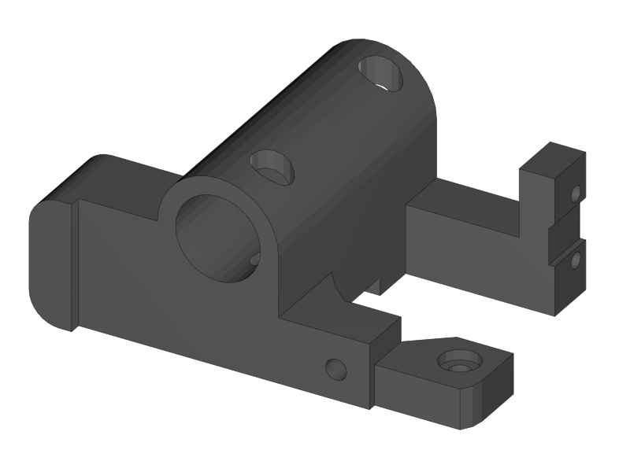
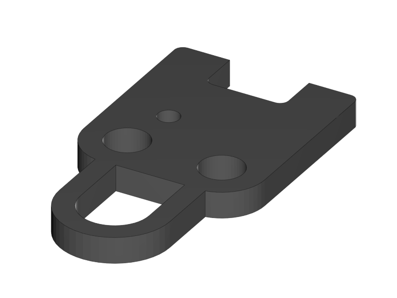
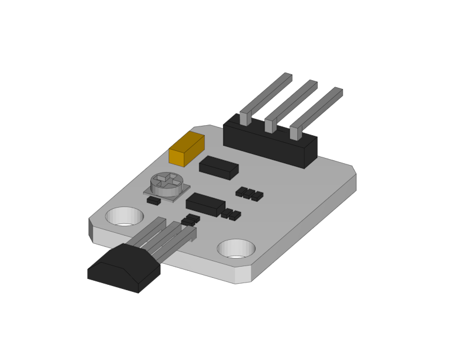
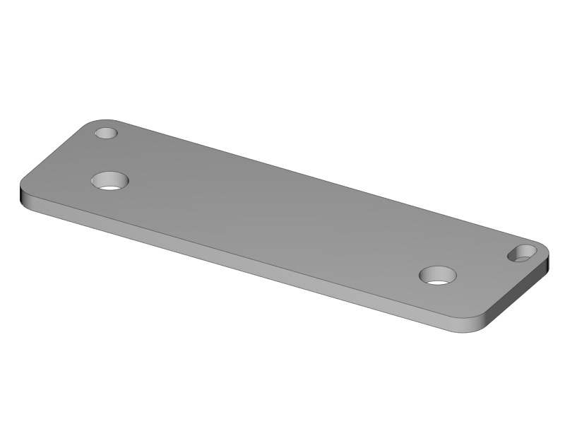
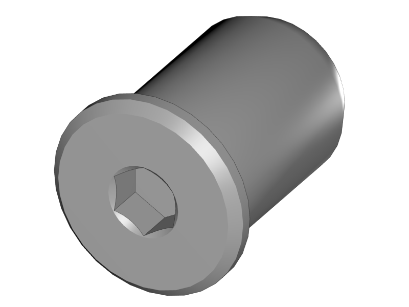
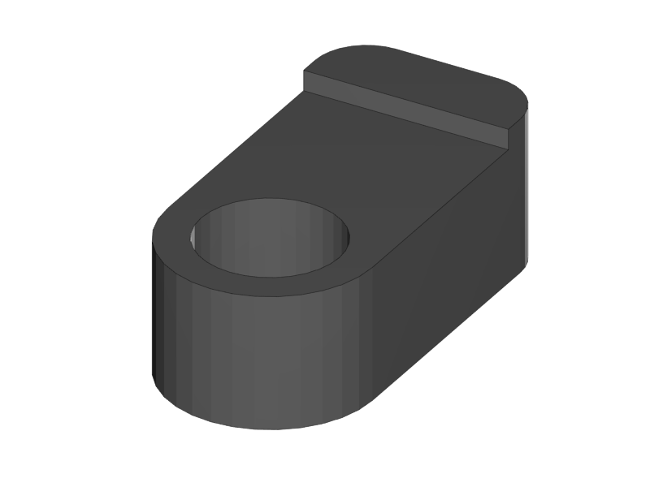

[Next](https://github.com/open3dengineering/i3_Berlin/wiki/Section-2.3-Assembly-of-the-Y-Unit-Mounting-the-Y-Carriage-and-Timing-Belt)

[Section
Menu](https://github.com/open3dengineering/i3_Berlin/wiki/Section-2-Assembly-of-the-Y-Unit)

<table>
<colgroup>
<col width="50%" />
<col width="50%" />
</colgroup>
<tbody>
<tr class="odd">
<td align="left">

</td>
<td align="left">
 
 1x Nema 17 48mm Stepper Motor
</td>
</tr>
<tr class="even">
<td align="left">
 
 1x GT2 Pulley
</td>
</tr>
</tbody>
</table>

-   Mount the pulley onto the motorshaft with the two little set screws.
    These screws you can find in the little white bag in the box of your
    RUMBA electronics.

-   The distance between the pulley and the motor is 8mm.

<table>
<colgroup>
<col width="50%" />
<col width="50%" />
</colgroup>
<tbody>
<tr class="odd">
<td align="left">

</td>
<td align="left">
 
 1x Y-Motor mount
</td>
</tr>
<tr class="even">
<td align="left">
 
 1x End-stop Cover Top
</td>
</tr>
<tr class="odd">
<td align="left">
 
 1x End-stop Cover Rim
</td>
</tr>
<tr class="even">
<td align="left">
 
 1x Hall-O End-stop
</td>
</tr>
<tr class="odd">
<td align="left">
 
 3x M3x10 Cylinder Screw
</td>
</tr>
<tr class="even">
<td align="left">
 
 2x Torx 3x10 Screw
</td>
</tr>
</tbody>
</table>

-   Mount the motor onto the Y-Motor Holder

-   Be sure that the motor connector is facing downwards.

-   Mount the end-stop with its cover. Don’t make the screws too tight.

    -   Find the covers in the bag with Acrylic laser cut parts

-   In the little box of the end-stops you will find 6 little magnets:
    don’t loose them!

<table>
<colgroup>
<col width="100%" />
</colgroup>
<tbody>
<tr class="odd">
<td align="left">

</td>
</tr>
</tbody>
</table>

The result looks like this

<table>
<colgroup>
<col width="50%" />
<col width="50%" />
</colgroup>
<tbody>
<tr class="odd">
<td align="left">

</td>
<td align="left">
 
 1x Power Connector
</td>
</tr>
<tr class="even">
<td align="left">
 
 2x Glass Fuse
</td>
</tr>
</tbody>
</table>

-   Put the two glass fuses into the power connector

-   Connect the high voltage power cable to the Power connector
    as shown.

    -   The connection might be stiff. Be patient and firm, but be
        careful not to break the power connector pins.

<table>
<colgroup>
<col width="50%" />
<col width="50%" />
</colgroup>
<tbody>
<tr class="odd">
<td align="left">

</td>
<td align="left">
 
 1x Back Plate
</td>
</tr>
</tbody>
</table>

-   Be gentle with the aluminium plates. You don’t want to scratch
    them already.

-   Click the power connector into the Back Plate.

<table>
<colgroup>
<col width="50%" />
<col width="50%" />
</colgroup>
<tbody>
<tr class="odd">
<td align="left">

</td>
<td align="left">
 
 1x Power Connector Cover
</td>
</tr>
<tr class="even">
<td align="left">
 
 1x Torx 3x16 Screw
</td>
</tr>
<tr class="odd">
<td align="left">
 
 1x Teethed Washer
</td>
</tr>
</tbody>
</table>

-   Pull the power cable through the hole on the left of the Power
    Connector Cover.

-   Mount the Power Connector Cover with the plastic screw.

-   The teeth washer should assure electrical contact between the ground
    wire and the aluminium back plate.

<table>
<colgroup>
<col width="50%" />
<col width="50%" />
</colgroup>
<tbody>
<tr class="odd">
<td align="left">

</td>
<td align="left">
 
 1x Front Plate
</td>
</tr>
<tr class="even">
<td align="left">
 
 2x Round Nut
</td>
</tr>
</tbody>
</table>

-   Put the front plate onto the threaded rods.

-   Put the round nuts to the M10 Threaded rods. Do not fix the front
    plate yet.

-   Firmly hold the M10 rod and fix the round nut onto the M10 rod.

-   The front plate should still be loose now.

<table>
<colgroup>
<col width="100%" />
</colgroup>
<tbody>
<tr class="odd">
<td align="left">

</td>
</tr>
</tbody>
</table>

-   Fix the front plate by tightening the round nuts.

<table>
<colgroup>
<col width="100%" />
</colgroup>
<tbody>
<tr class="odd">
<td align="left">

</td>
</tr>
</tbody>
</table>

-   Tighten the M10 nuts on both sides of both Y-Middle parts

-   Make sure that both parts remain straight.

<table>
<colgroup>
<col width="50%" />
<col width="50%" />
</colgroup>
<tbody>
<tr class="odd">
<td align="left">

</td>
<td align="left">
 
 2x Smooth Rod 8 x 385
</td>
</tr>
<tr class="even">
<td align="left">
 
 3x LM8UU Linear Bearing
</td>
</tr>
<tr class="odd">
<td align="left">
 
 1x Y-Back Left
</td>
</tr>
<tr class="even">
<td align="left">
 
 2x Round Nut
</td>
</tr>
</tbody>
</table>

-   In general be careful with the aluminium parts and prevent scratches
    by putting a towel on the table.

-   Test if the smooth rods can enter the hole in the aluminium plates.
    The holes in the aluminium plates are very accurate and the smooth
    rods might have a little bur from cutting them. If they don’t fit,
    carefully file of the edge of the rods a little bit until they
    all fit.

-   Put the linear bearings to the rods.

-   Put the Y-Motor Holder and the Y-Back Left part to the M10 threaded
    rods

-   Put the smooth rods to the front plate.

    -   Mind that the right hand rod has two bearings, the left rod
        only one.

    -   Make sure that the left hand rod enters the slot hole in the
        front plate through the slot hole of the Y-Height adjuster. With
        the height adjuster you will late make the two smooth rods
        perfectly parallel.

-   Put the Back Plate to the M10 Rods.

-   Tighten the round nuts and the corresponding M10 nuts in such a way
    that the back plate is nice and straight.

The result looks like this:

<table>
<colgroup>
<col width="100%" />
</colgroup>
<tbody>
<tr class="odd">
<td align="left">

</td>
</tr>
</tbody>
</table>

<table>
<colgroup>
<col width="100%" />
</colgroup>
<tbody>
<tr class="odd">
<td align="left">

</td>
</tr>
</tbody>
</table>

-   If you are having difficulties to make the unit straight try what
    happens when you loosen the M4 screw on the Power Supply, make the
    unit straight and fix it again.

[Next](https://github.com/open3dengineering/i3_Berlin/wiki/Section-2.3-Assembly-of-the-Y-Unit-Mounting-the-Y-Carriage-and-Timing-Belt)
