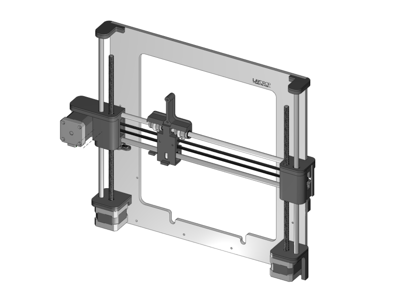

[Next Section](https://github.com/open3dengineering/i3_Berlin/wiki/Section-4-Wiring)

<table>
<colgroup>
<col width="100%" />
</colgroup>
<tbody>
<tr class="odd">
<td align="left">

</td>
</tr>
</tbody>
</table>

This is what you will build in this Section. Check the subsections below and have fun building!

[Section 3.1](https://github.com/open3dengineering/i3_Berlin/wiki/Section-3.1-Assembly-of-the-XZ-Unit-Mounting-the-X-Axis): Mounting the X-Axis

[Section 3.2](https://github.com/open3dengineering/i3_Berlin/wiki/Section-3.2-Assembly-of-the-XZ-Unit-Mounting-the-Z-Axis): Mounting the Z-Axis

[Section 3.3](https://github.com/open3dengineering/i3_Berlin/wiki/Section-3.3-Assembly-of-the-XZ-Unit-Mounting-the-Timing-Belt): Mounting the Timing Belt

[Next Section](https://github.com/open3dengineering/i3_Berlin/wiki/Section-4-Wiring)
