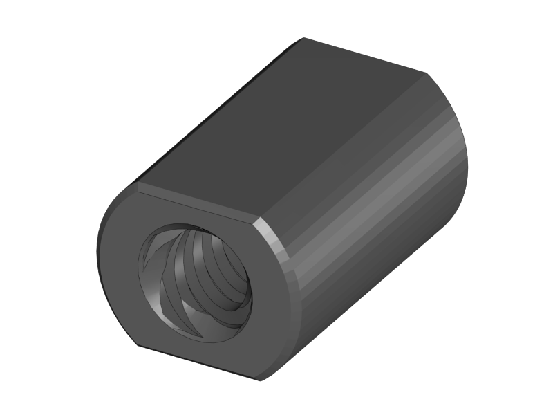

[Next](https://github.com/laydrop/i3_Berlin/wiki/Section-3.2-Assembly-of-the-XZ-Unit-Mounting-the-Z-Axis)

<table>
<colgroup>
<col width="50%" />
<col width="50%" />
</colgroup>
<tbody>
<tr class="odd">
<td align="left">

</td>
<td align="left">
 
 1x X-Motor
</td>
</tr>
<tr class="even">
<td align="left">
 
 1x X-Bearing Holder Left
</td>
</tr>
<tr class="odd">
<td align="left">
 
 2x LM8UU Linear Bearing
</td>
</tr>
<tr class="even">
<td align="left">
 
 1x ACME Nut
</td>
</tr>
<tr class="odd">
<td align="left">
 
 2x Torx 3x16 Screw
</td>
</tr>
<tr class="even">
<td align="left">
 
 1x 8mm Smooth Rod
</td>
</tr>
</tbody>
</table>

-   Put the linear bearings onto any of the smooth rods

    -   This is to keep the bearings straight while you mount them.

-   Put the bearings and the rod into the bearing slots of the X-Motor

-   Put the ACME Nut into the slot of the X-Motor Holder

    -   You can find the ACME Nut on the threaded rod of your linear stepper motor

-   Place the Bearing Holder

-   Fix the Bearing Holder with the two Torx screws.

-   Remove the smooth rod

<table>
<colgroup>
<col width="50%" />
<col width="50%" />
</colgroup>
<tbody>
<tr class="odd">
<td align="left">

</td>
<td align="left">
 
 1x Hall-O Endstop
</td>
</tr>
<tr class="even">
<td align="left">
 
 1x Endstop Cover Top
</td>
</tr>
<tr class="odd">
<td align="left">
 
 1x Endstop Cover Rim
</td>
</tr>
<tr class="even">
<td align="left">
 
 2x Torx 3x10 Screw
</td>
</tr>
</tbody>
</table>

-   Mount the endstop with its cover onto the X-Motor assembly.

-   Don’t make the screws too tight.

<table>
<colgroup>
<col width="50%" />
<col width="50%" />
</colgroup>
<tbody>
<tr class="odd">
<td align="left">

</td>
<td align="left">
 
 1x Nema 17 48mm Stepper Motor
</td>
</tr>
<tr class="even">
<td align="left">
 
 1x GT2 Pulley
</td>
</tr>
</tbody>
</table>

-   Mount the pulley onto the motor shaft.

-   Fix it with the two little set screws that you can find again in the white bag in your RUMBA electronics box.

-   The distance between the motor and the pulley is 4.5mm.

<table>
<colgroup>
<col width="50%" />
<col width="50%" />
</colgroup>
<tbody>
<tr class="odd">
<td align="left">

</td>
<td align="left">
 
 3x M3x10 Cylinder Screw
</td>
</tr>
<tr class="even">
<td align="left">
 
 3x M3 Washer
</td>
</tr>
</tbody>
</table>

-   Mount the motor onto the X-Motor holder.

<table>
<colgroup>
<col width="50%" />
<col width="50%" />
</colgroup>
<tbody>
<tr class="odd">
<td align="left">

</td>
<td align="left">
 
 1x X-Idler
</td>
</tr>
<tr class="even">
<td align="left">
 
 1x X-Bearing Holder Right
</td>
</tr>
<tr class="odd">
<td align="left">
 
 2x LM8UU Linear Bearing
</td>
</tr>
<tr class="even">
<td align="left">
 
 1x ACME Nut
</td>
</tr>
<tr class="odd">
<td align="left">
 
 2x Torx 3x16 Screw
</td>
</tr>
<tr class="even">
<td align="left">
 
 1x 8mm Smooth Rod
</td>
</tr>
</tbody>
</table>

-   Put the linear bearings onto a smooth rod

-   Put the linear bearings with the smooth rod into the pocket for the bearings

-   Put the ACME Nut

-   Place the bearing holder

-   Fix it with two M3x16 Torx screws

-   Remove the rod

-   Note: the bearings can move left and right a couple of millimeters (with some friction). This is to avoid load on the bearings that can be caused by tolerances in the length of the linear rods of the X-Axis.

<table>
<colgroup>
<col width="50%" />
<col width="50%" />
</colgroup>
<tbody>
<tr class="odd">
<td align="left">

</td>
<td align="left">
 
 1x X-Carriage
</td>
</tr>
<tr class="even">
<td align="left">
 
 1x X-Teeth
</td>
</tr>
<tr class="odd">
<td align="left">
 
 2x Torx 3x10 Screws
</td>
</tr>
</tbody>
</table>

-   Pierce the holes in the X-Carriage.

    -   The hole is closed of with one print layer for good print results. You can easily pierce it by pushing with a small allen key or screw driver from the other side.

-   Slide the X-Teeth into position

-   Fix the teeth with the screws.

<table>
<colgroup>
<col width="50%" />
<col width="50%" />
</colgroup>
<tbody>
<tr class="odd">
<td align="left">

</td>
<td align="left">
 
 3x LM8UU Linear Bearing
</td>
</tr>
<tr class="even">
<td align="left">
 
 1x 8mm Smooth Rod
</td>
</tr>
<tr class="odd">
<td align="left">
 
 3x Ziptie 4.4mm
</td>
</tr>
</tbody>
</table>

-   Place the upper two bearings into their slots

-   Slide a smooth rod through the bearings

-   Mount the upper two bearings with a ziptie. Mind the orientation of the head.

    -   If you don’t have a big ziptie, fix it with TWO small zipties for better stability.

-   Remove the smooth rod

-   Push in the lower linear bearing

-   Mount it with a ziptie.

<table>
<colgroup>
<col width="50%" />
<col width="50%" />
</colgroup>
<tbody>
<tr class="odd">
<td align="left">

</td>
<td align="left">
 
 1x 8mm x 400 Smooth Rod
</td>
</tr>
<tr class="even">
<td align="left">
 
 1x 8mm x 343 Smooth Rod
</td>
</tr>
</tbody>
</table>

-   Slide the long (400mm) smooth rod into the upper hole of the X-Motor holder

    -   Make sure it reaches to the end.

    -   If it goes too stiff you can put the end into a hand drill. Do not use a hammer.

-   Slide the short smooth rod in the the X-Motor holder

-   Slide the X-Carriage assembly onto the rods. Mind the orientation!

-   Slide the X-Idler onto the smooth rods. Again make sure that they reach until the end of the hole.

    -   If it goes stiff make a light twisting movement with you hands while you push the plastic parts more and more together.

[Next](https://github.com/laydrop/i3_Berlin/wiki/Section-3.2-Assembly-of-the-XZ-Unit-Mounting-the-Z-Axis)
