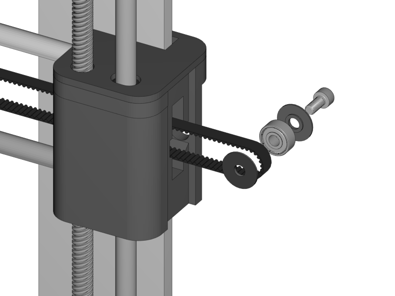
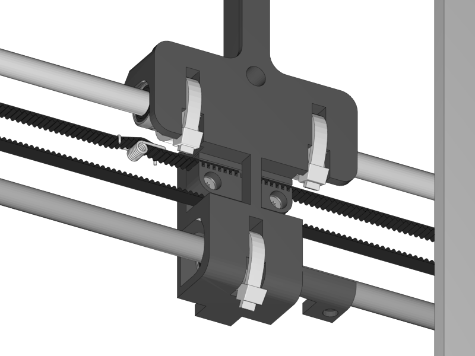
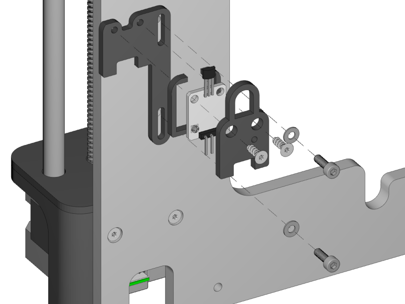
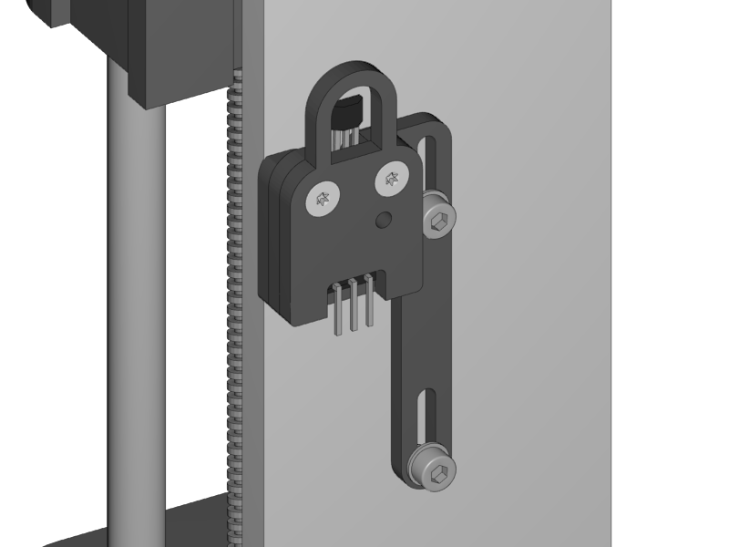
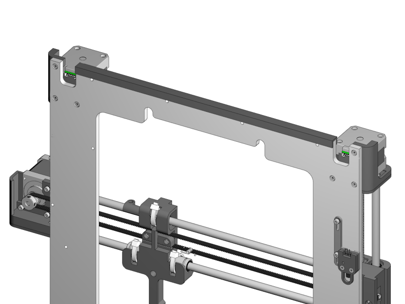

[Next](https://github.com/laydrop/i3-Berlin/wiki/Section-3.4-Assembling-the-Extruder)

<table>
<colgroup>
<col width="50%" />
<col width="50%" />
</colgroup>
<tbody>
<tr class="odd">
<td align="left">

</td>
<td align="left">
 
 2x Belt Guiding Disc
</td>
</tr>
<tr class="even">
<td align="left">
 
 1x M4x10 Cylinder Screw
</td>
</tr>
<tr class="odd">
<td align="left">
 
 1x 624ZZ Bearing
</td>
</tr>
<tr class="even">
<td align="left">
 
 1x GT2 Timing Belt 836mm
</td>
</tr>
<tr class="odd">
<td align="left">
 
 1x Belt Tensioner
</td>
</tr>
</tbody>
</table>

-   Put the bearing onto the M4 screw with a Belt Guiding Disc on both sides

    -   Make sure that the little notch of the discs is facing the bearing. The smooth surface is facing outwards.

-   Lead the timing belt throught the opening of the X-Idler holder.

-   Put the bearing assembly throught the loop

-   Pull it back into the X-Idler holder.

    -   You just slide in the idler bearing with screw from the side. No need to screw anything, the tension of the belt will keep the bearing in its place.

<table>
<colgroup>
<col width="100%" />
</colgroup>
<tbody>
<tr class="odd">
<td align="left">

</td>
</tr>
</tbody>
</table>

-   Push one end of the timing belt into the teeth of the X-Axis

-   Lead the remaining long side through the opening underneath the Teeth.

-   Loosen the screws of the X-Motor a little bit, and slide the motor some millimeters in the direction of the X-Carriage.

-   Lead the timing belt over the motor pulley

-   Lead it back into the direction of the X-Carriage.

-   Put the Belt Tensioner on the belt as shown.

-   Push the remaining end of the timing belt into the X-Teeth.

-   Set the tension not too tight.

-   Tighten the timing belt by sliding the motor to the right and fix it again with its screws.

    -   If the belt moves up and down a little when you move the X-Carriage the belt is too loose

    -   If the belt makes sound like a guitar string, it is too tight.

-   If the belt tensioner is (almost) straight as shown the tension is right.

<table>
<colgroup>
<col width="50%" />
<col width="50%" />
</colgroup>
<tbody>
<tr class="odd">
<td align="left">

</td>
<td align="left">
 
 1x Z-Endstop Holder
</td>
</tr>
<tr class="even">
<td align="left">
 
 1x Endstop Cover Top
</td>
</tr>
<tr class="odd">
<td align="left">
 
 1x Endstop Cover Rim
</td>
</tr>
<tr class="even">
<td align="left">
 
 1x Hall-O Endstop
</td>
</tr>
<tr class="odd">
<td align="left">
 
 2x Torx 3x10 Screw
</td>
</tr>
<tr class="even">
<td align="left">
 
 2x M3x10 Screw
</td>
</tr>
<tr class="odd">
<td align="left">
 
 2x M3 Washer
</td>
</tr>
</tbody>
</table>

-   Mount the end-stop and with its cover onto the Z-Endstop holder with the Torx screws.

    -   Be carefull to not tighten the screws too much.

-   Mount the Z-Endstop assembly onto the backside of the aluminium frame in the most upper position.

-   Mount the Z-Endstop in the upper position as shown below.

<table>
<colgroup>
<col width="100%" />
</colgroup>
<tbody>
<tr class="odd">
<td align="left">

</td>
</tr>
</tbody>
</table>

<table>
<colgroup>
<col width="50%" />
<col width="50%" />
</colgroup>
<tbody>
<tr class="odd">
<td align="left">

</td>
<td align="left">
 
 1x Rubber Strip
</td>
</tr>
</tbody>
</table>

-   Put the rubber strip to the bottom of the XZ-Frame with some drips of super glue.

[Next](https://github.com/laydrop/i3-Berlin/wiki/Section-3.4-Assembling-the-Extruder)
