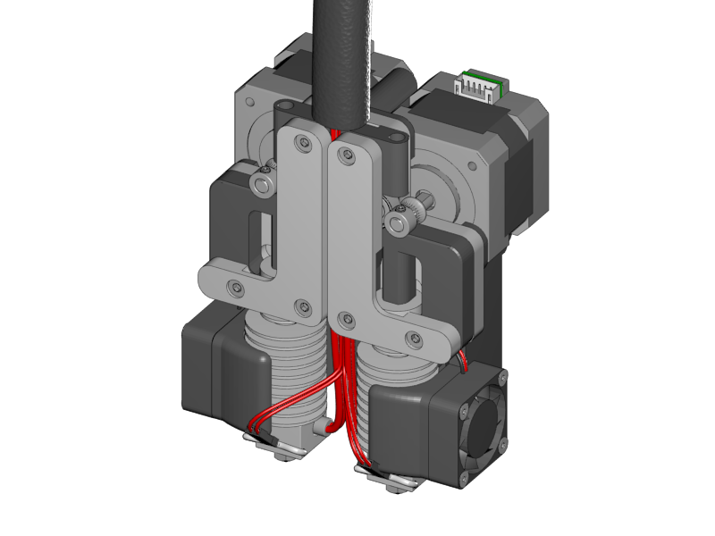
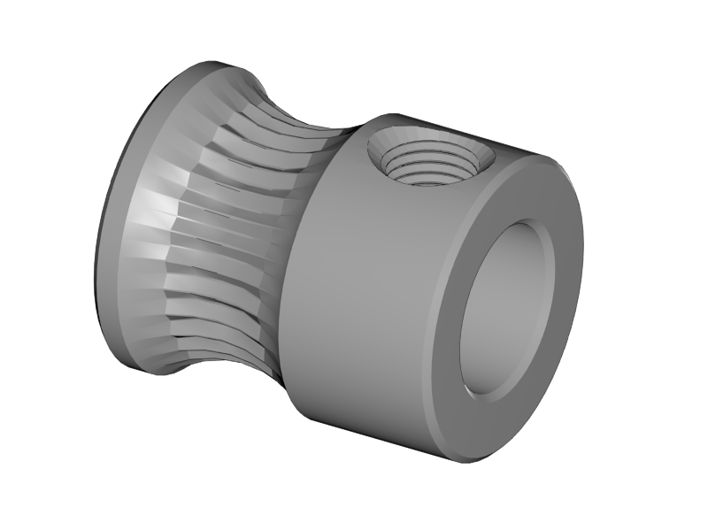
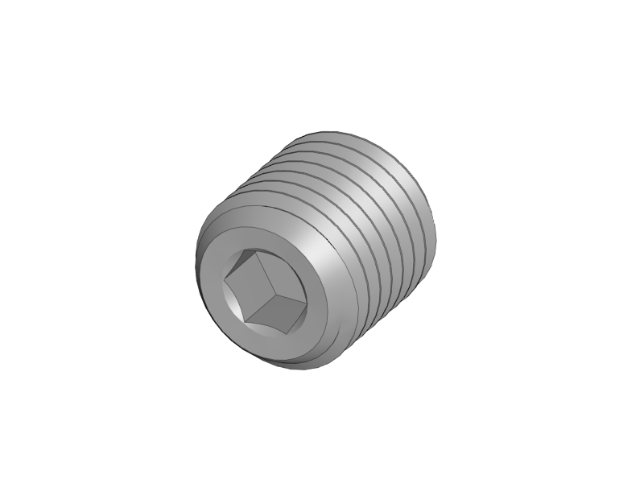
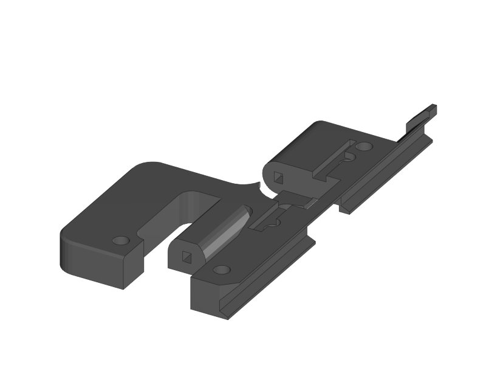
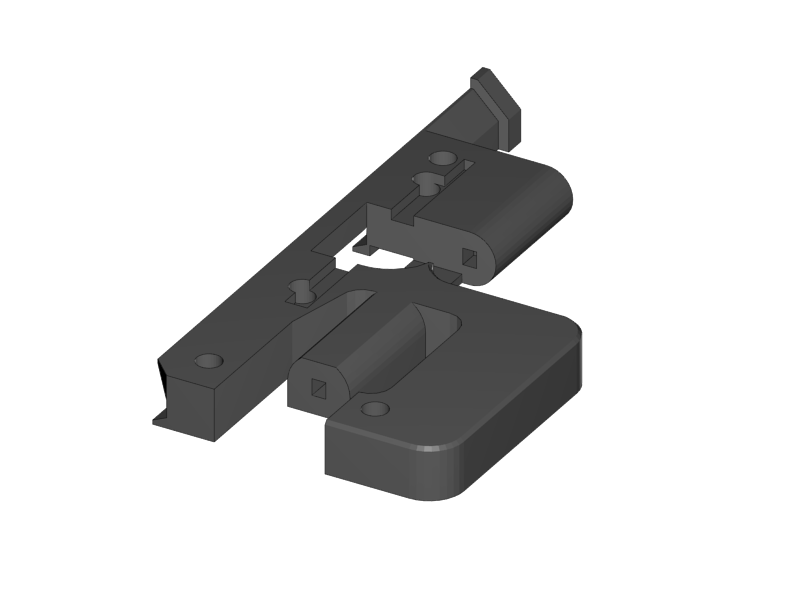
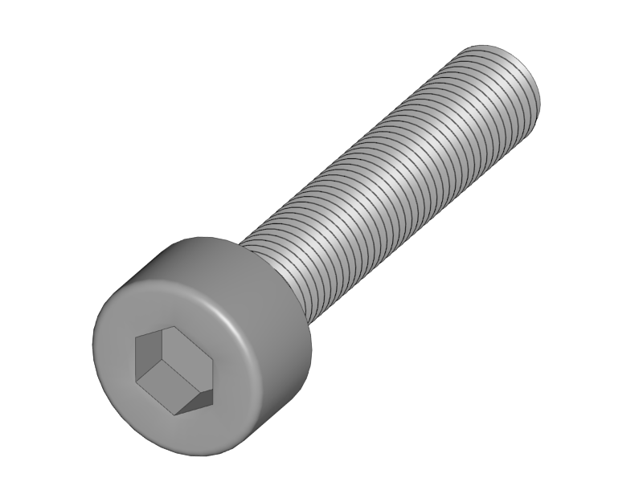
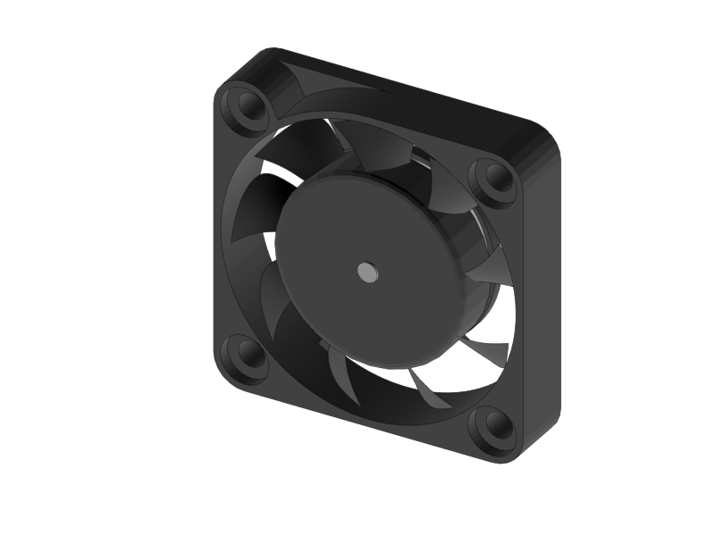
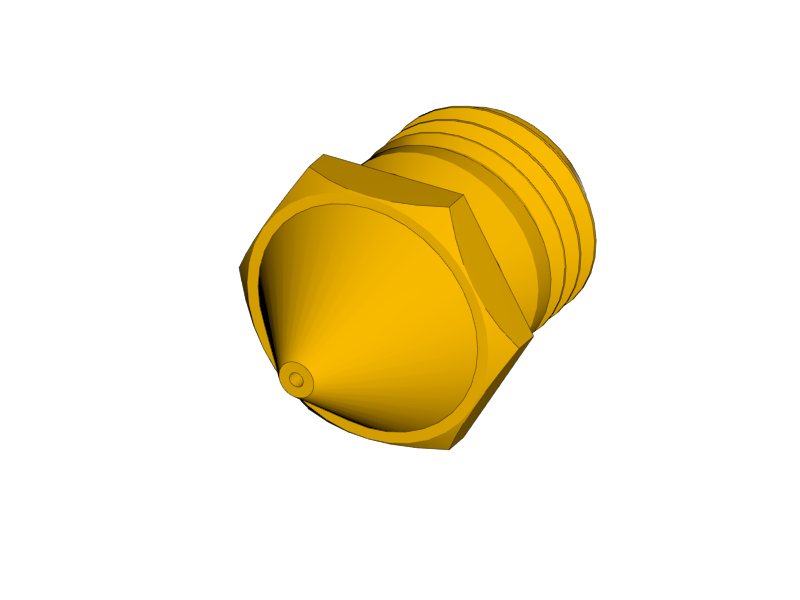
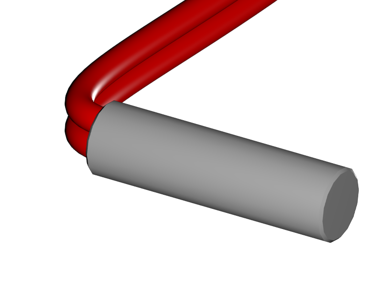
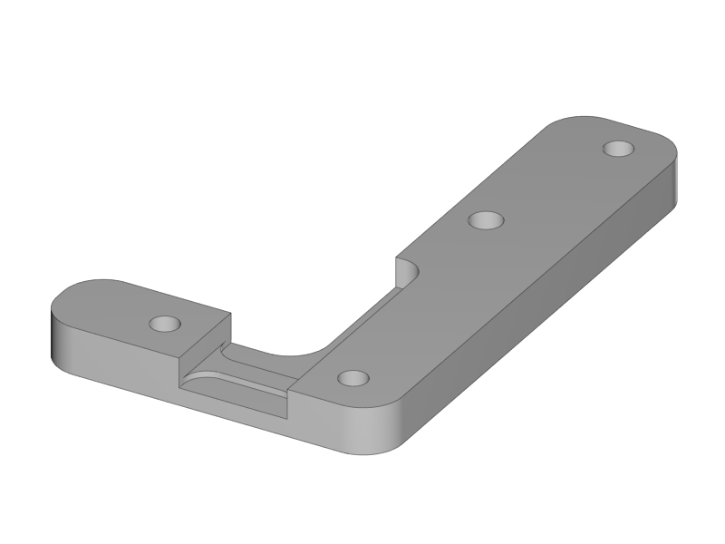

[Next](https://github.com/laydrop/i3-Berlin/wiki/Section-4-Wiring)

<table>
<colgroup>
<col width="100%" />
</colgroup>
<tbody>
<tr class="odd">
<td align="left">

</td>
</tr>
</tbody>
</table>

Finally it is time to build the extruder. The design of the extruder is made to be a dual extruder, but you can also make it a single extruder by leaving out the right hand motor and hotend.

<table>
<colgroup>
<col width="50%" />
<col width="50%" />
</colgroup>
<tbody>
<tr class="odd">
<td align="left">

</td>
<td align="left">
 
 1x Nema 17
</td>
</tr>
<tr class="even">
<td align="left">
 
 1x Filament Pulley
</td>
</tr>
<tr class="odd">
<td align="left">
 
 1x M3x3 Set Screw
</td>
</tr>
</tbody>
</table>

-   Turn the set screw into the filament pulley

-   Fix the filament pulley onto the motor shaft

-   Make sure that:

    -   The screw is on the front

    -   The screw touches the flat side of the motor shaft

    -   The front of the pulley and the motor shaft are flush

-   For a dual extruder, prepare two motors

<table>
<colgroup>
<col width="50%" />
<col width="50%" />
</colgroup>
<tbody>
<tr class="odd">
<td align="left">

</td>
<td align="left">
 
 1x Extruder Base Plate
</td>
</tr>
<tr class="even">
<td align="left">
 
 1x Extruder Fan Holder
</td>
</tr>
<tr class="odd">
<td align="left">
 
 2x M3x12 Counter Sunk
</td>
</tr>
</tbody>
</table>

-   Mount both motors onto the fan holder and base plate

-   Make sure the motors are straight and tighten the screws well

<table>
<colgroup>
<col width="50%" />
<col width="50%" />
</colgroup>
<tbody>
<tr class="odd">
<td align="left">

</td>
<td align="left">
 
 1x Extruder Center Left
</td>
</tr>
<tr class="even">
<td align="left">
 
 1x Extruder Center Right
</td>
</tr>
<tr class="odd">
<td align="left">
 
 4x M3x20 Screw
</td>
</tr>
</tbody>
</table>

-   Make sure the filament path is free. Test it with a piece of filament.

-   Put the plastic parts onto the assembly, but do not tighten the screws yet

-   For single extruder put the right plastic part later, and fix it with the aluminium plate

<table>
<colgroup>
<col width="50%" />
<col width="50%" />
</colgroup>
<tbody>
<tr class="odd">
<td align="left">

</td>
<td align="left">
 
 2x Extruder Spring
</td>
</tr>
</tbody>
</table>

-   Slide the extruder springs behind the plastic part.

-   Push them all the way in, with the aid of the other extruder springs.

<table>
<colgroup>
<col width="50%" />
<col width="50%" />
</colgroup>
<tbody>
<tr class="odd">
<td align="left">

</td>
<td align="left">
 
 2x 624ZZ Bearing
</td>
</tr>
<tr class="even">
<td align="left">
 
 2x 4h8 Dowel
</td>
</tr>
</tbody>
</table>

-   Put the dowel through the bearing

-   Place into the slot hole of the aluminium base plate

-   Repeat for dual extruder

<table>
<colgroup>
<col width="50%" />
<col width="50%" />
</colgroup>
<tbody>
<tr class="odd">
<td align="left">

</td>
<td align="left">
 
 2x Extruder Spring
</td>
</tr>
</tbody>
</table>

-   Slide the remaining two extruder springs behind the heads of the M3x20 screws

-   Tighten the screws (but not too tight!!)

    -   The ball bearing is (almost) touching the filament pulley

<table>
<colgroup>
<col width="50%" />
<col width="50%" />
</colgroup>
<tbody>
<tr class="odd">
<td align="left">

</td>
<td align="left">
 
 1x Radial Fan
</td>
</tr>
<tr class="even">
<td align="left">
 
 2x 30mm Fan
</td>
</tr>
<tr class="odd">
<td align="left">
 
 4x Torx 3 x 16 Screw
</td>
</tr>
</tbody>
</table>

-   Click the radial fan into the designated slots of the extruder fanholder part

    -   Lead the wire through the cable channel

-   Mount the fans onto the extruder fanholder

    -   Make sure the wires for the fans are soldered so the fans are powered with 1 connector

    -   Lead the cables through the cable channel

<table>
<colgroup>
<col width="50%" />
<col width="50%" />
</colgroup>
<tbody>
<tr class="odd">
<td align="left">

</td>
<td align="left">
 
 2x E3D Cooler Body
</td>
</tr>
<tr class="even">
<td align="left">
 
 2x E3D Heat Break
</td>
</tr>
<tr class="odd">
<td align="left">
 
 2x E3D Heater Block
</td>
</tr>
<tr class="even">
<td align="left">
 
 2x E3D Nozzle
</td>
</tr>
</tbody>
</table>

-   Screw the Heatbreak and the nozzle into the Heater Block

    -   Handtight is well enough

-   Screw the cooler body onto the Heatbreak

    -   Make it tight, but only hand tight

    -   Understand that the heatbreak has a very thin *neck* which can be damaged with a too high force

<table>
<colgroup>
<col width="100%" />
</colgroup>
<tbody>
<tr class="odd">
<td align="left">

</td>
</tr>
</tbody>
</table>

-   Adjust the nozzle in such a way that there is just a couple of tenths of a millimeter between the heater block and the head of the nozzle.

    -   The neck of the heat break should be more or less flush with the top of the heater block

    -   Everything is fixed, but only hand tight

    -   Later the nozzle will be fixed while the hotend is heated to 300°C. This is to make sure the nozzle is press fit to the heat break

    -   Fixing the nozzle like this also reduces mechanical load on the heat break while fixing the nozzle

<table>
<colgroup>
<col width="50%" />
<col width="50%" />
</colgroup>
<tbody>
<tr class="odd">
<td align="left">

</td>
<td align="left">
 
 2x Thermistor
</td>
</tr>
</tbody>
</table>

-   Put a piece of heat resistant insulation on both legs of the thermistor

    -   Leave about 5mm of blank metal for connection

<table>
<colgroup>
<col width="50%" />
<col width="50%" />
</colgroup>
<tbody>
<tr class="odd">
<td align="left">

</td>
<td align="left">
 
 2x Heat Cartridge
</td>
</tr>
<tr class="even">
<td align="left">
 
 2x M3 Set Screw
</td>
</tr>
</tbody>
</table>

-   Slide the heat cartridge into the hole of the heater block

    -   The left side of the cartridge should be flush with the heater block

    -   Gently fix it with the set screw

    -   In a dual set up the cartridges are mirrored. Use the picture of the next step as a reference

-   Slide the thermistor into the little hole

    -   Make sure the thermistor is (more or less) in the middle

    -   Bend the leads so it cannot slide

    -   Bend the leads together so you can connect it later with a connector.

<table>
<colgroup>
<col width="50%" />
<col width="50%" />
</colgroup>
<tbody>
<tr class="odd">
<td align="left">

</td>
<td align="left">
 
 1x Extruder Front Plate L
</td>
</tr>
<tr class="even">
<td align="left">
 
 1x Extruder Front Plate R
</td>
</tr>
<tr class="odd">
<td align="left">
 
 6x M3x20 Counter Sunk
</td>
</tr>
<tr class="even">
<td align="left">
 
 4x Torx 3 x 16 Screw
</td>
</tr>
<tr class="odd">
<td align="left">
 
 2x FanDuct
</td>
</tr>
</tbody>
</table>

-   Put the hotends onto the extruder base plate

-   Connect the thermistors. Polarity is not important

-   Lead the wires through the wire channel

-   Lead the wires of the heat cartridges through the wire channel

-   Fix the hotends with the aluminium front-plates

    -   The right hotend can slide some millimeters in it slot.

    -   Mount it as far up as possible. The exact height will be adjusted later.

-   Mount the fan duct in front of the hotends with the torx screws

[Next](https://github.com/laydrop/i3-Berlin/wiki/Section-4-Wiring)
