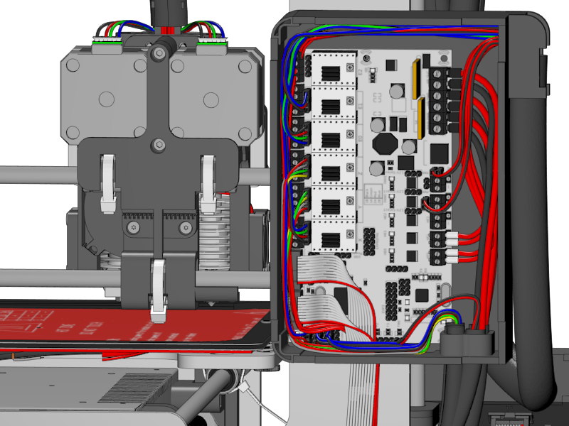

[Next
Section](https://github.com/open3dengineering/i3_Berlin/wiki/Section-5-Calibration)

You made the main units. After wiring up the Y-Unit you will put them
together. While you’re at it, just wire everything, including preparing
the wiring for the extruder and the heatbed, that you will assemble
later. We prefer organized wiring over spaghetti. It is important how
you put the cables, so have a good look at all the nice 3D renders we
made.

<table>
<colgroup>
<col width="100%" />
</colgroup>
<tbody>
<tr class="odd">
<td align="left">

</td>
</tr>
</tbody>
</table>

[open](file:staticmedia/WiringDiagram.svg)

<table>
<colgroup>
<col width="100%" />
</colgroup>
<tbody>
<tr class="odd">
<td align="left">

</td>
</tr>
</tbody>
</table>

[Section
4.1](https://github.com/open3dengineering/i3_Berlin/wiki/Section-4.1-Wiring-the-Power-Supply):
Wiring the Power Supply  
 [Section
4.2](https://github.com/open3dengineering/i3_Berlin/wiki/Section-4.2-Wiring-the-Z-Unit):
Wiring the Z-Unit  
 [Section
4.3](https://github.com/open3dengineering/i3_Berlin/wiki/Section-4.3-Wiring-the-Y-Unit):
Wiring the Y-Unit  
 [Section
4.4](https://github.com/open3dengineering/i3_Berlin/wiki/Section-4.4-Wiring-the-X-Axis):
Wiring the X-Axis  
 [Section
4.5](https://github.com/open3dengineering/i3_Berlin/wiki/Section-4.5-Gluing-the-Endstop-Magnets):
Gluing the Endstop Magnets  
 [Section
4.6](https://github.com/open3dengineering/i3_Berlin/wiki/Section-4.6-Uploading-Firmware):
Uploading Firmware  
 [Section
4.7](https://github.com/open3dengineering/i3_Berlin/wiki/Section-4.7-Wiring-the-Extruder):
Wiring the Extruder  
 [Section
4.8](https://github.com/open3dengineering/i3_Berlin/wiki/Section-4.8-Mounting-the-Heatbed):
Mounting the Heatbed  

[Next
Section](https://github.com/open3dengineering/i3_Berlin/wiki/Section-5-Calibration)
