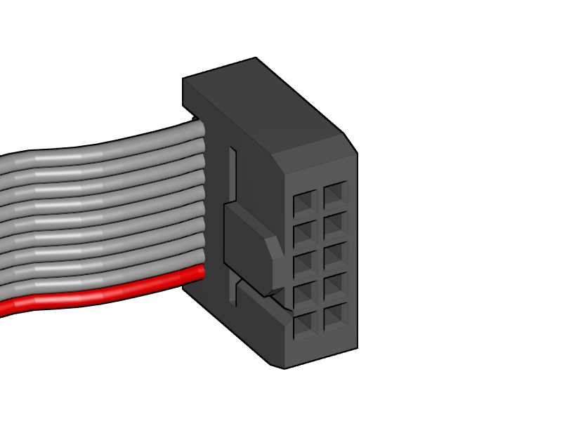

[Next](https://github.com/open3dengineering/i3_Berlin/wiki/Section-4.2-Wiring-the-Z-Unit)

<table>
<colgroup>
<col width="50%" />
<col width="50%" />
</colgroup>
<tbody>
<tr class="odd">
<td align="left">

</td>
<td align="left">
 
 1x Power Supply Cover
</td>
</tr>
</tbody>
</table>

-   Lead all the power wires through the opening of the Power Supply Cover

-   Connect the red wires to the 12V+

-   Connect the black wires to the 12V-

-   Connect the green/yellow cable to the GND, recognizable by the symbol of a striped arrow pointing downwards.

-   Connect the brown high voltage cable to the L

-   Connect the blue high voltage cable to the N

-   Check again if everything is correct and that there is no chance for electrical short circuits.

-   Make the screws really tight.

<table>
<colgroup>
<col width="100%" />
</colgroup>
<tbody>
<tr class="odd">
<td align="left">

</td>
</tr>
</tbody>
</table>

-   Close the lid of the Power Supply

-   Slide in the Power Supply Cover

<table>
<colgroup>
<col width="100%" />
</colgroup>
<tbody>
<tr class="odd">
<td align="left">

</td>
</tr>
</tbody>
</table>

-   Now is the big moment to join the two units!

-   Put the Y-Unit into the XZ Unit.

-   Make sure that all the washers are at the front of the XZ plate

-   Make sure that the left hand nuts are still loose and have ample place for the XZ plate to fit in.

-   Tighten the right hand nut

<table>
<colgroup>
<col width="100%" />
</colgroup>
<tbody>
<tr class="odd">
<td align="left">

</td>
</tr>
</tbody>
</table>

-   Slide the Y-Carriage to the back

-   Look from the top with one eye to see if the Y-Carriage is parallel to the XZ-Plate

<table>
<colgroup>
<col width="100%" />
</colgroup>
<tbody>
<tr class="odd">
<td align="left">

</td>
</tr>
</tbody>
</table>

-   Close the left hand front nut and the flange nut

-   Always keep looking that the XZ-Plate is parallel to the Y-Carriage

-   Tighten the left hand nuts completely and lock it with the rear M10 nut.

-   Congratulations! It suddenly looks much more like a 3D printer!

<table>
<colgroup>
<col width="100%" />
</colgroup>
<tbody>
<tr class="odd">
<td align="left">

</td>
</tr>
</tbody>
</table>

-   Search for the flatband cables in the box of your graphic display controller

-   Remove the cables from the adapter

-   Notice that the cable has slightly different connectors on both ends

-   Pick the end where the little notch on the connector is in the same direction as the cable.

<table>
<colgroup>
<col width="50%" />
<col width="50%" />
</colgroup>
<tbody>
<tr class="odd">
<td align="left">

</td>
<td align="left">
 
 1x RUMBA
</td>
</tr>
<tr class="even">
<td align="left">
 
 2 x M3x10 Cylinder Screw
</td>
</tr>
<tr class="odd">
<td align="left">
 
 2 x Spacer
</td>
</tr>
</tbody>
</table>

-   Plug in the flatband cables

-   There is a black mark on the PCB of the RUMBA, this is where the notch of the connector should be. Also mind the orientation of the red wire as shown in the picture above.

-   Fold the flatband cables so they both leave neatly through the opening in the RUMBA Case

-   Mount the RUMBA with its case to the frame with the two screws.

    -   Put the two spacers between the RUMBA and the case.

<table>
<colgroup>
<col width="50%" />
<col width="50%" />
</colgroup>
<tbody>
<tr class="odd">
<td align="left">

</td>
<td align="left">
 
 Power Connection
</td>
</tr>
</tbody>
</table>

-   Lead the Power-wires through the inlet hole in the casing.

-   Connect them to both the 12V inputs on the RUMBA

    -   Mind the polarity of the wires!

[Next](https://github.com/open3dengineering/i3_Berlin/wiki/Section-4.2-Wiring-the-Z-Unit)
