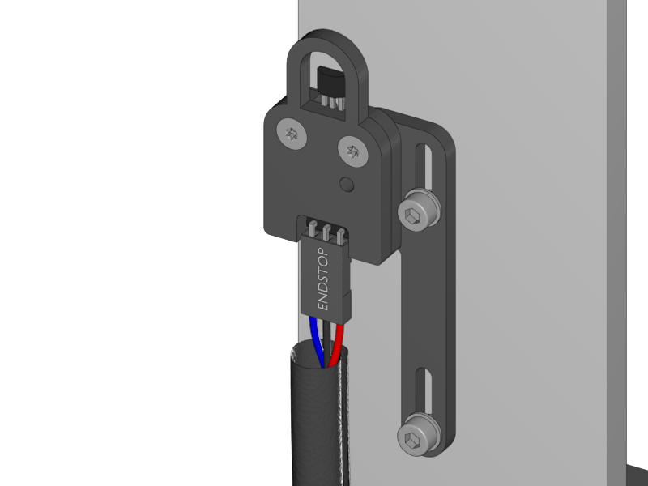
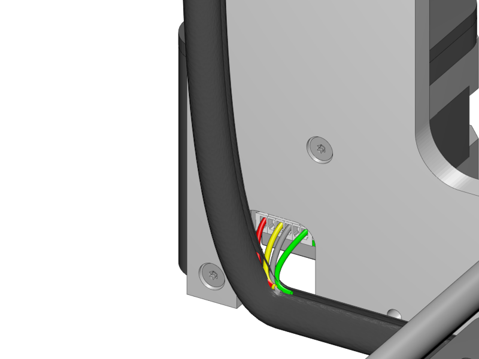
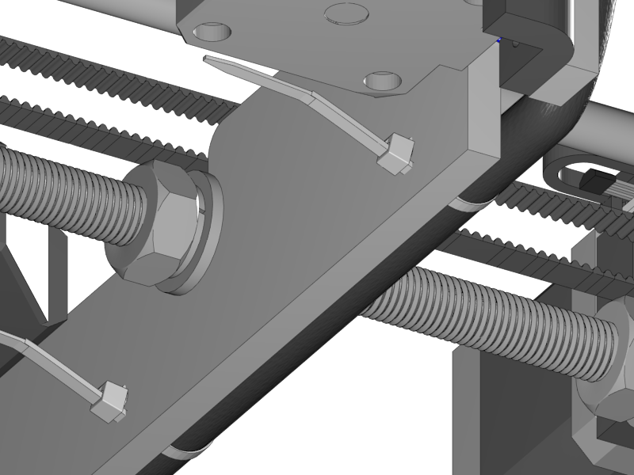
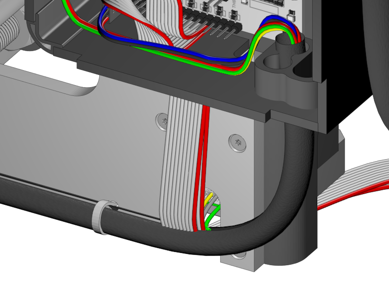
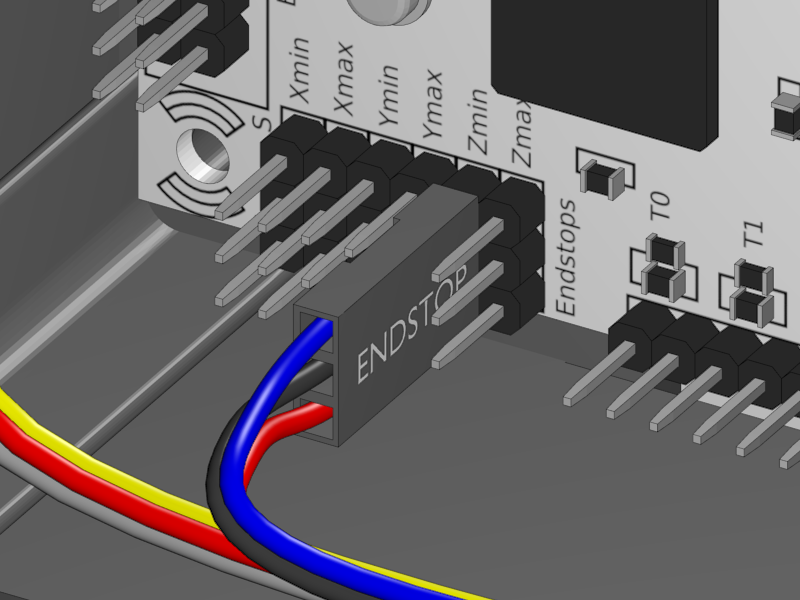
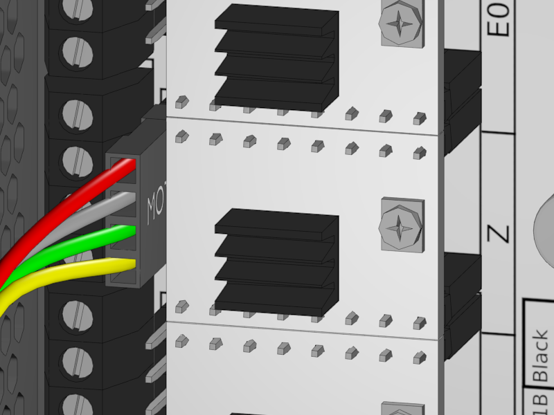

[Next](https://github.com/laydrop/i3_Berlin/wiki/Section-4.3-Wiring-the-Y-Unit)

<table>
<colgroup>
<col width="50%" />
<col width="50%" />
</colgroup>
<tbody>
<tr class="odd">
<td align="left">

</td>
<td align="left"></td>
</tr>
</tbody>
</table>

-   Connect the Z-Endstop cable to the endstop, which is 67cm long.

-   Mind the orientation of the connector. The red wire should be on the right.

-   Apply a piece of 54cm long braided sleeve to the cable.

<table>
<colgroup>
<col width="100%" />
</colgroup>
<tbody>
<tr class="odd">
<td align="left">

</td>
</tr>
</tbody>
</table>

-   The Z-Motors are serially connected. The cable is made to have two motor connector and one connector that goes on the electronics.

-   Connect the longer end of the Z-Motor cable to the motor closest to the endstop.

-   Join the cable into the braided sleeve.

<table>
<colgroup>
<col width="100%" />
</colgroup>
<tbody>
<tr class="odd">
<td align="left">

</td>
</tr>
</tbody>
</table>

-   Attach the braided sleeve to the aluminium plate with 4 zipties.

-   Be sure that the zipties are not on the bottom of the plate. Make it exactly as shown in the picture.

<table>
<colgroup>
<col width="100%" />
</colgroup>
<tbody>
<tr class="odd">
<td align="left">

</td>
</tr>
</tbody>
</table>

-   Connect the shorter end of the Z-Motor cable to the other Z-motor and lead the cable through the braided sleeve.

-   Make sure that the flatband cable is behind the Z-Cable leaving to the front through the hole of the Z-Motor.

<table>
<colgroup>
<col width="50%" />
<col width="50%" />
</colgroup>
<tbody>
<tr class="odd">
<td align="left">

</td>
<td align="left">
 
 Z-Endstop Connection
</td>
</tr>
<tr class="even">
<td align="left">
 
 Z-Motor Connection
</td>
</tr>
</tbody>
</table>

-   Connect the endstop and the motor to the Rumba.

    -   If the motor wires are red grey yellow green put the red wire on top.

[Next](https://github.com/laydrop/i3_Berlin/wiki/Section-4.3-Wiring-the-Y-Unit)
