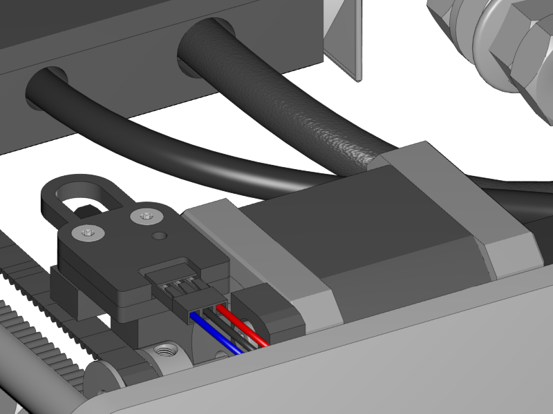
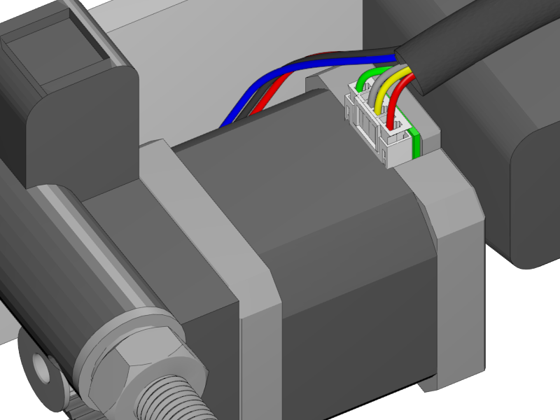
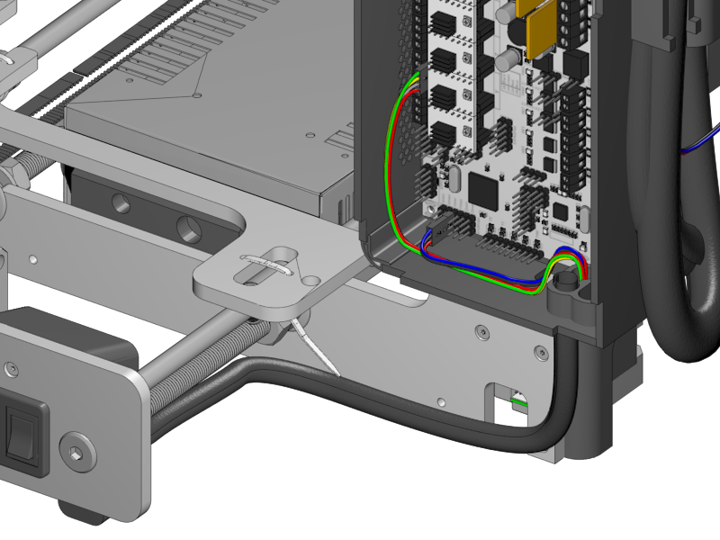
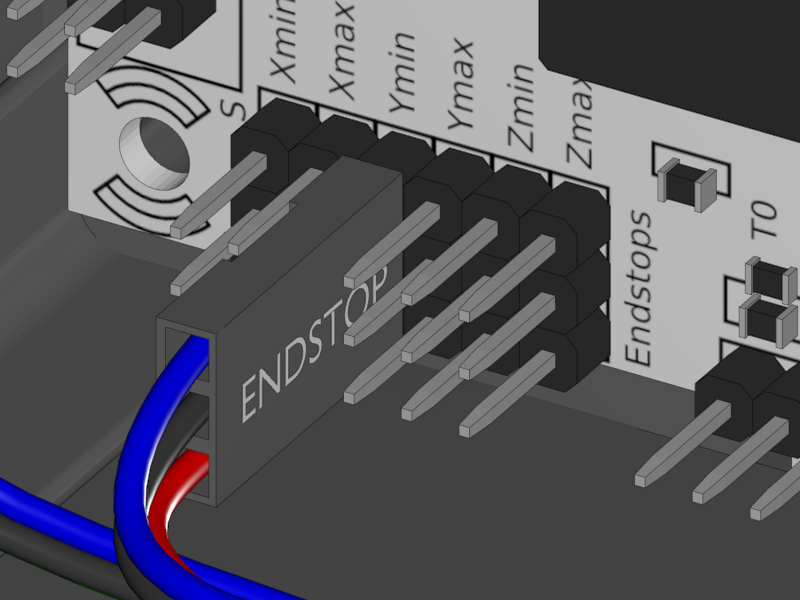
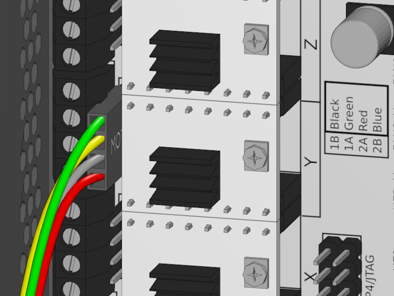

[Next](https://github.com/laydrop/i3_Berlin/wiki/Section-4.4-Wiring-the-X-Axis)

<table>
<colgroup>
<col width="100%" />
</colgroup>
<tbody>
<tr class="odd">
<td align="left">

</td>
</tr>
</tbody>
</table>

-   Look for the Y endstop cable, which is 58 centimeters long.

-   Connect the end stop. Mind the orientation of the connector. The red wire is on the right where the writing on the PCB says "S" for "signal".

<table>
<colgroup>
<col width="100%" />
</colgroup>
<tbody>
<tr class="odd">
<td align="left">

</td>
</tr>
</tbody>
</table>

-   Search for the Y motor cable, which is 60 centimeters long

-   Connect it to the motor.

-   Lead the endstop cable through the back of the motor and join them at the motor connector

-   Put both cables into the Y Braided Sleeve, which is 39 centimeters long.

<table>
<colgroup>
<col width="50%" />
<col width="50%" />
</colgroup>
<tbody>
<tr class="odd">
<td align="left">

</td>
<td align="left">
 
 Y-Endstop connector
</td>
</tr>
<tr class="even">
<td align="left">
 
 Y-Motor connector
</td>
</tr>
</tbody>
</table>

-   Lead the cables in the Braided Sleeve neatly through the hole in the Rumba casing.

-   Connect the Y-Endstop to the "Y minus" in the endstop block. The red wire is at the bottom.

-   Connect the Y-Motor to the Y motor Driver. The black wire goes up.

    -   If the colorscheme of your motor cable is red grey yellow green, the red one goes up.

[Next](https://github.com/laydrop/i3_Berlin/wiki/Section-4.4-Wiring-the-X-Axis)
