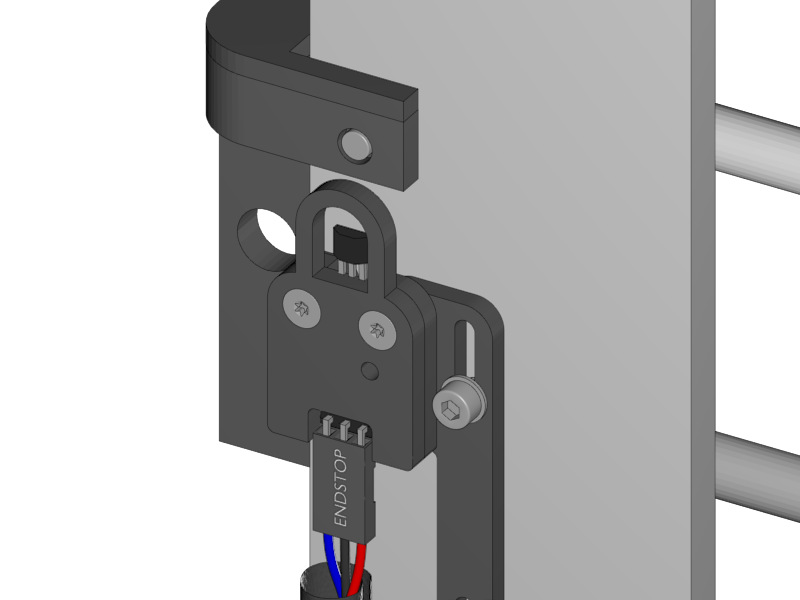

[Next](https://github.com/laydrop/i3_Berlin/wiki/Section-4.6-Uploading-Firmware)

<table>
<colgroup>
<col width="100%" />
</colgroup>
<tbody>
<tr class="odd">
<td align="left">

</td>
</tr>
</tbody>
</table>

-   Double check the electrical connections

-   If you are sure that everything is right you can connect the power to the printer

-   Some LED’s should start blinking and probably your axes will start moving.

    -   The moving axes are a bit in the way for what we are going to do, so disconnect all the motors for the moment.

-   Check if all the endstops light green.

    -   You have to look well, because we’ve hidden the bright light underneath the acrylic cover.

-   Look for the little magnets that came with the endstops.

-   Put one magnet on a little allen key, and move it under the endstop sensor.

    -   If the light turns of the orientation is correct

    -   If nothing happens, turn around the magnet and try again.

-   Mark the orientation.

<table>
<colgroup>
<col width="100%" />
</colgroup>
<tbody>
<tr class="odd">
<td align="left">

</td>
</tr>
</tbody>
</table>

-   Put a drop of 1 second super glue into the magnet slot of the Y-Teeth

-   Put the magnet into the slot in the correct orientation.

    -   Tip: you can easily get the magnet from the allen key with aid of the blue white ceramic screwdriver that came with your RUMBA.

-   Test if the green light turns of if you move the Y-Carriage underneath the end stop.

<table>
<colgroup>
<col width="100%" />
</colgroup>
<tbody>
<tr class="odd">
<td align="left">

</td>
</tr>
</tbody>
</table>

-   Flip over the printer so you can easily reach the X magnet slot.

-   Just as with the Y magnet, find the right orientation of the magnet

-   Glue it with a drop of 1 second super glue and test if it works correctly.

<table>
<colgroup>
<col width="100%" />
</colgroup>
<tbody>
<tr class="odd">
<td align="left">

</td>
</tr>
</tbody>
</table>

-   Leave the printer up side down and glue the Z-EndStop.

-   Put back the printer on its feet again

-   Turn down the X-Bridge manually by turning the Z-Motors with your hands. Try to keep the X-Bridge somewhat straight.

-   Check if the endstop works correctly.

[Next](https://github.com/laydrop/i3_Berlin/wiki/Section-4.6-Uploading-Firmware)
