[Next](https://github.com/laydrop/i3-Berlin/wiki/Section-4.8-Mounting-the-Heatbed)

<table>
<colgroup>
<col width="100%" />
</colgroup>
<tbody>
<tr class="odd">
<td align="left">
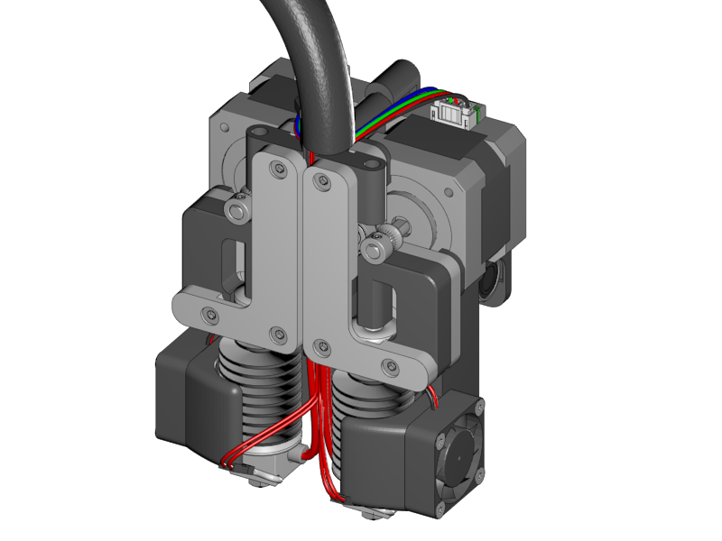
</td>
</tr>
</tbody>
</table>

-   Connect the extruder motor with the remaining motor cables of 1 meter long.

-   Label all the wires in such a way that you will know which connector belongs to which wire.

    -   Note: the left extruder is numbered "0", the right extruder is numbered "1".

    -   Label all four heater cables as HE0 or HE1

    -   Label the motor cables as E0 and E1

    -   Label the termistor cables as T0 and T1

    -   Label the Active fan as A-Fan

    -   Label the Extruder cooler fans as E-Fan

-   Lead all the wires through the thick braided sleeve.

-   Fix the braided sleeve onto the extruder unit with a zit tie.

<table>
<colgroup>
<col width="100%" />
</colgroup>
<tbody>
<tr class="odd">
<td align="left">
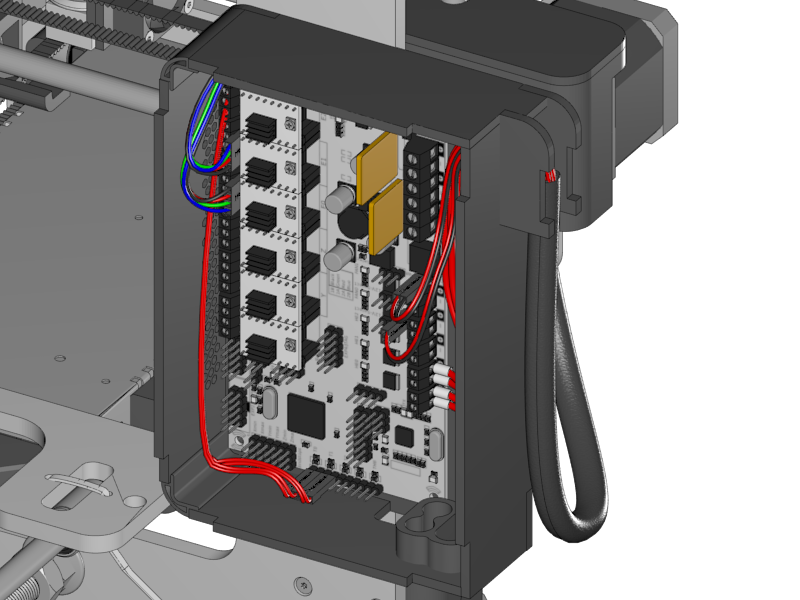
</td>
</tr>
</tbody>
</table>

-   Lead the cable into the RUMBA case through the side inlet.

-   Connect the wires accordingly to the picture above. Detail pictures will follow below.

<table>
<colgroup>
<col width="100%" />
</colgroup>
<tbody>
<tr class="odd">
<td align="left">
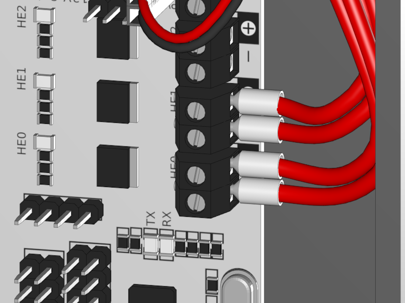
</td>
</tr>
</tbody>
</table>

-   Connect the heaters to the HE0 and HE1.

    -   Polarity is not important.

<table>
<colgroup>
<col width="100%" />
</colgroup>
<tbody>
<tr class="odd">
<td align="left">
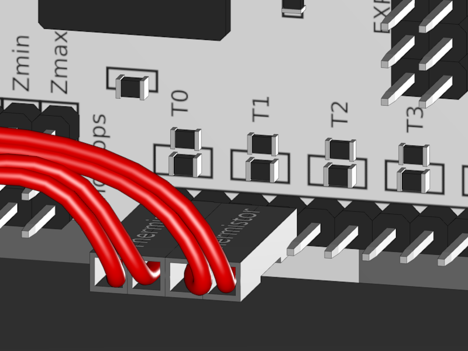
</td>
</tr>
</tbody>
</table>

-   Connect the thermistors to T0 and T1.

    -   Polarity is not important

<table>
<colgroup>
<col width="100%" />
</colgroup>
<tbody>
<tr class="odd">
<td align="left">
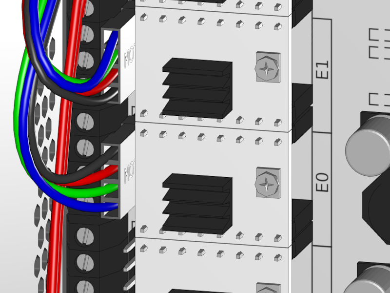
</td>
</tr>
</tbody>
</table>

-   Connect the extruder motors to E0 and E1.

    -   Note that the connectors are in a mirrored ordered.

    -   In case the brand of the extruder motor is "Moons" note that the wire order is black red green blue or red yellow grey green.

<table>
<colgroup>
<col width="100%" />
</colgroup>
<tbody>
<tr class="odd">
<td align="left">
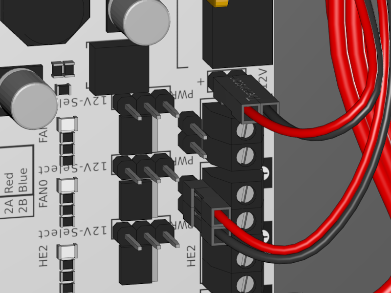
</td>
</tr>
</tbody>
</table>

-   Connect the Active Fan to the Fan 0

    -   Note that the red wire is on the positive and the negative on the black

-   Connect the Extruder Fan(s) to the 12V output.

    -   If you are building a dual extruder you will probably see a double wire for each pin.

    -   Connect the red wire to the positive and the black to negative.

<table>
<colgroup>
<col width="100%" />
</colgroup>
<tbody>
<tr class="odd">
<td align="left">
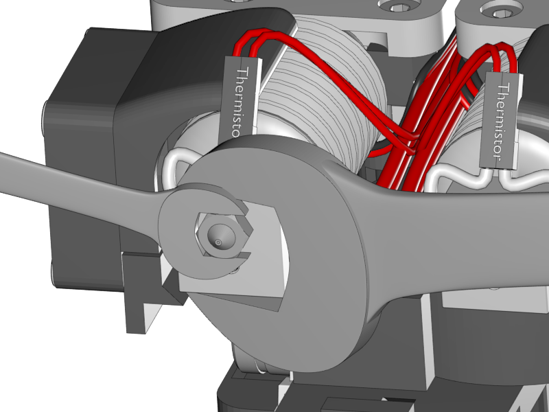
</td>
</tr>
</tbody>
</table>

-   Put the extruder unit on a heat resitant surface.

-   Turn on the printer.

-   In the display menu push the button once and turn it to navigate to Control.

-   Continue to Temperature and Nozzle 0. And set the temperature to 150 degrees Celcius. Push the button once more to confirm.

-   The nozzle heats up now (be carefull).

    -   Note the first time the extruder heats up it produces some burning smells. This is nothing to worry about and also something that will soon go away.

-   Wait until the temperature is stable for some minutes. Then increase the temperature to 280°C.

-   Wait until the temperature is reached and carefully fix the nozzle with a 17mm and 8mm wrench as shown above.

-   Let it cool down. Now test again if the heater still works (sometimes they break) by putting the temperature to 150°C (the nozzle should be colder than 150°C of course). If it heats up than everythings fine. If not you’ll have to replace the heat cardridge.

-   Do the same for the right hand extruder.

<table>
<colgroup>
<col width="50%" />
<col width="50%" />
</colgroup>
<tbody>
<tr class="odd">
<td align="left">
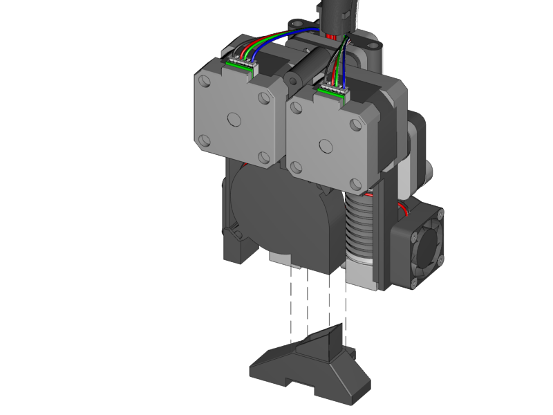
</td>
<td align="left">
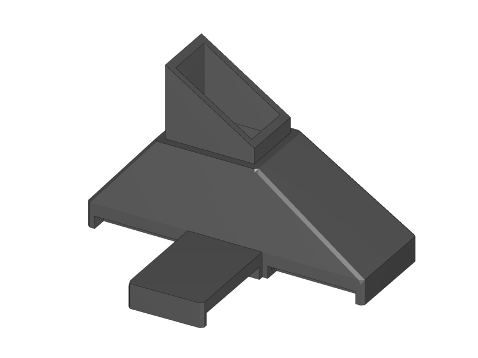 
 1x Active Cooling Duct
</td>
</tr>
</tbody>
</table>

-   Slide the Active Cooling duct into the air outlet of the radial fan.

<table>
<colgroup>
<col width="50%" />
<col width="50%" />
</colgroup>
<tbody>
<tr class="odd">
<td align="left">
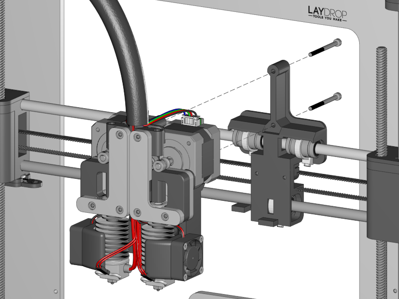
</td>
<td align="left">
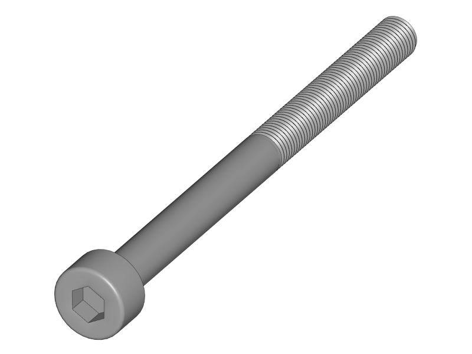 
 2x M3x40 screw
</td>
</tr>
</tbody>
</table>

-   Put the extruder unit onto the X-Carriage.

-   Make sure that the cavity on the back of the cooling duct stands on the notch of the X-Carriage

-   Fix the unit with the two screws

<table>
<colgroup>
<col width="50%" />
<col width="50%" />
</colgroup>
<tbody>
<tr class="odd">
<td align="left">
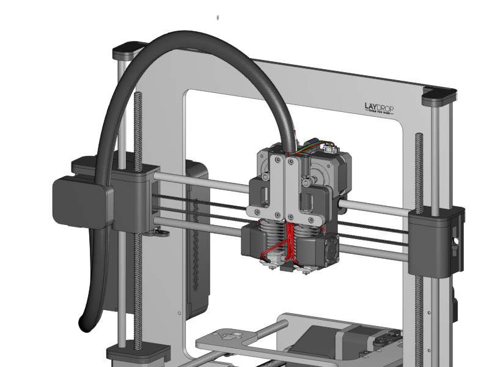
</td>
<td align="left">
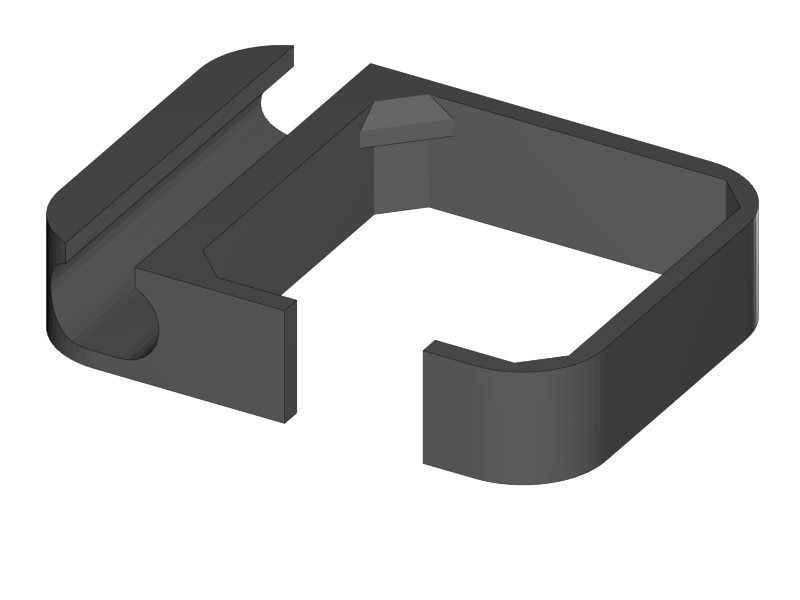 
 1x Cable Holder
</td>
</tr>
<tr class="even">
<td align="left">
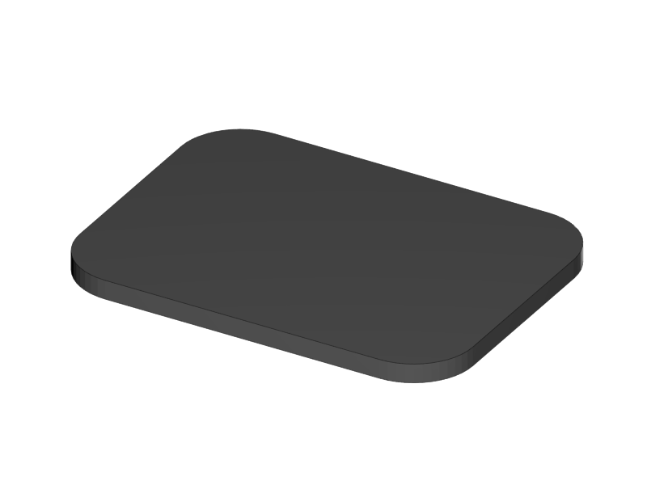 
 1x Cable Holder Cover
</td>
</tr>
</tbody>
</table>

-   Put the braided sleeve into the opening of the Cable Holder.

    -   Take care that the length is enough so the extruder can reach easily to the far right. \*\*

-   Put the cable holder onto the X-Motor

-   Join the wires of the X into the braided sleeve.

-   If wires are entangled too much, reconnect them in such a way that all cables are neatly organized.

[Next](https://github.com/laydrop/i3-Berlin/wiki/Section-4.8-Mounting-the-Heatbed)
