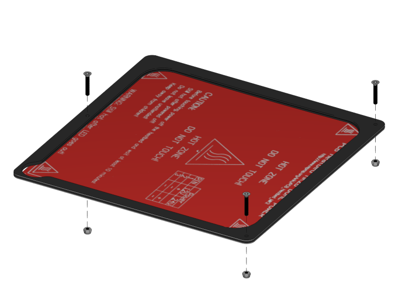
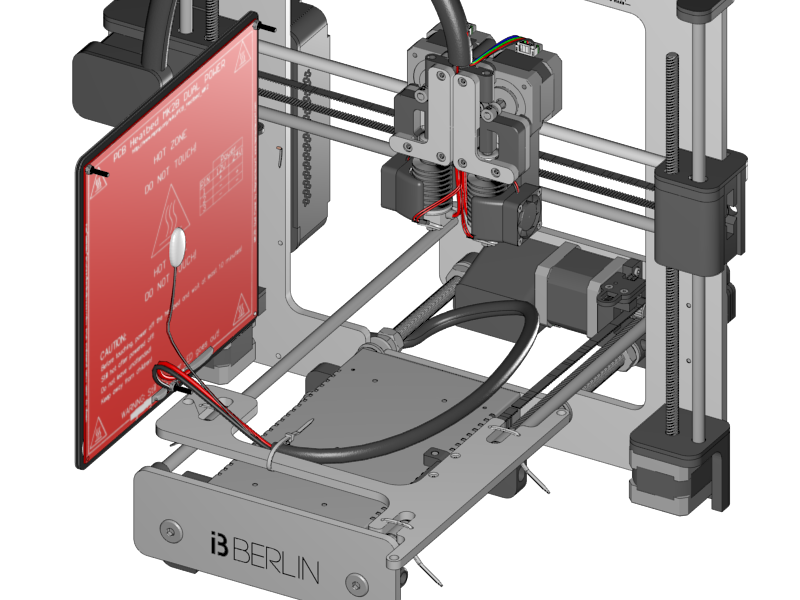
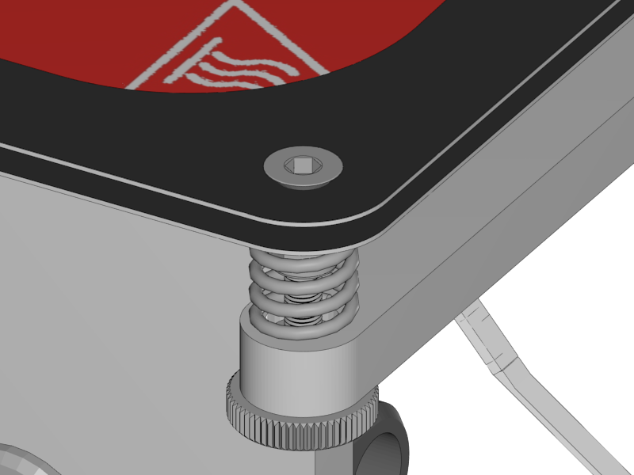
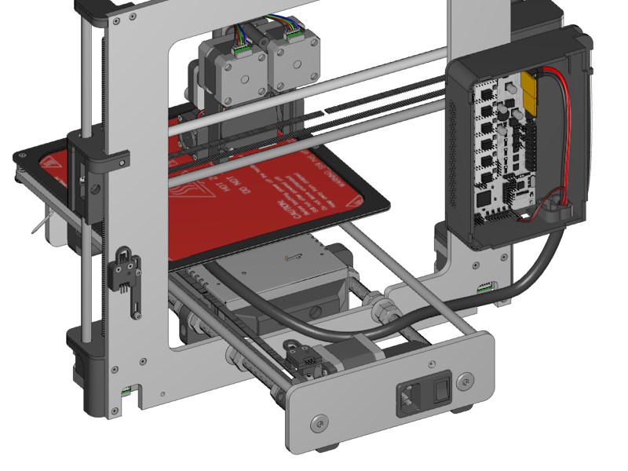
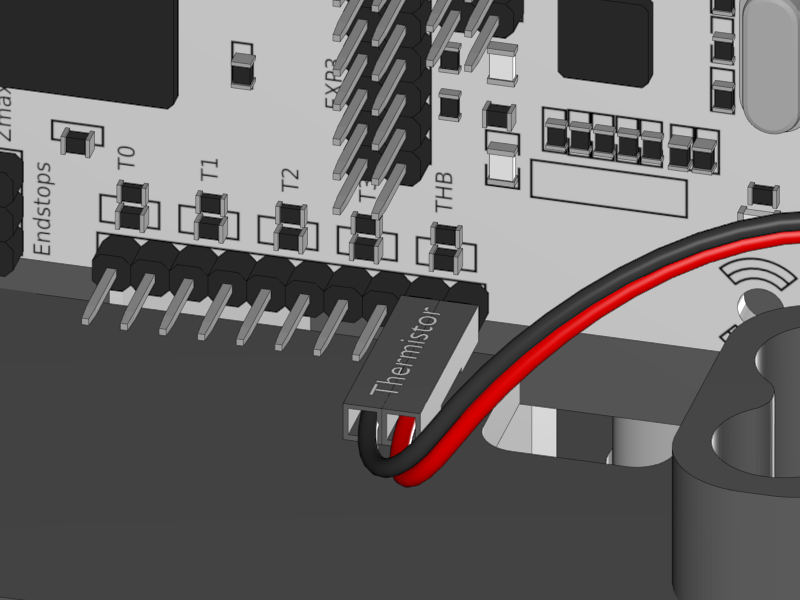
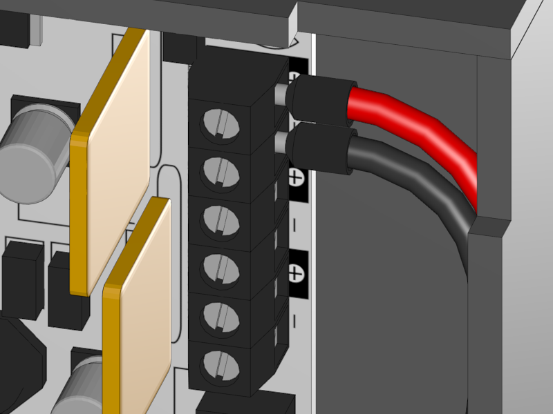

[Next](https://github.com/laydrop/i3-Berlin/wiki/Section-5-Calibration)

<table>
<colgroup>
<col width="50%" />
<col width="50%" />
</colgroup>
<tbody>
<tr class="odd">
<td align="left">

</td>
<td align="left">
 
 1x Heatbed
</td>
</tr>
<tr class="even">
<td align="left">
 
 1x Mirror Clamp
</td>
</tr>
<tr class="odd">
<td align="left">
 
 3x M3x20 CounterSunk
</td>
</tr>
<tr class="even">
<td align="left">
 
 3x Lock Nut
</td>
</tr>
</tbody>
</table>

-   Mount the Mirror Clamp onto the Heatbed with the screws and nuts.

    -   The matt side is mounted on top.

-   Tighten the nuts until the head of the screws is being pulled smoothly into the material of the mirror clamp.

<table>
<colgroup>
<col width="50%" />
<col width="50%" />
</colgroup>
<tbody>
<tr class="odd">
<td align="left">

</td>
<td align="left">
 
 1x Ziptie
</td>
</tr>
</tbody>
</table>

-   Hold the heatbed on the left side of the y-carriage as shown in the picture above

-   Fix the braided sleeve of the heatbed cable to the back of the y-carriage with a zip tie

-   Lay down the heatbed and organize the cable so that the wires are neatly underneath the heatbed.

<table>
<colgroup>
<col width="50%" />
<col width="50%" />
</colgroup>
<tbody>
<tr class="odd">
<td align="left">

</td>
<td align="left">
 
 3x M3 Knurled Nut
</td>
</tr>
<tr class="even">
<td align="left">
 
 3x Spring
</td>
</tr>
</tbody>
</table>

-   Put the springs over the screws.

-   Tighten them with the knurled nuts.

-   The adjusting of the heatbed happens in the next chapter so don’t bother about it now.

<table>
<colgroup>
<col width="50%" />
<col width="50%" />
</colgroup>
<tbody>
<tr class="odd">
<td align="left">

</td>
<td align="left">
 
 Heatbed Thermistor Connection
</td>
</tr>
<tr class="even">
<td align="left">
 
 Heatbed Power Connection
</td>
</tr>
</tbody>
</table>

-   Connect the heatbed to the RUMBA

    -   Fix the cable in such a way that it does not obstruct the movement of the Y-Axis.

    -   Probably the cable runs smoothest if guided between the M10 rod and the smooth rod.

    -   Experiment with how to fix the cable with zipties for optimal movement.

[Next](https://github.com/laydrop/i3-Berlin/wiki/Section-5-Calibration)
