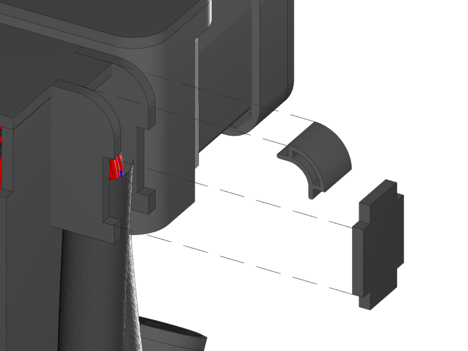
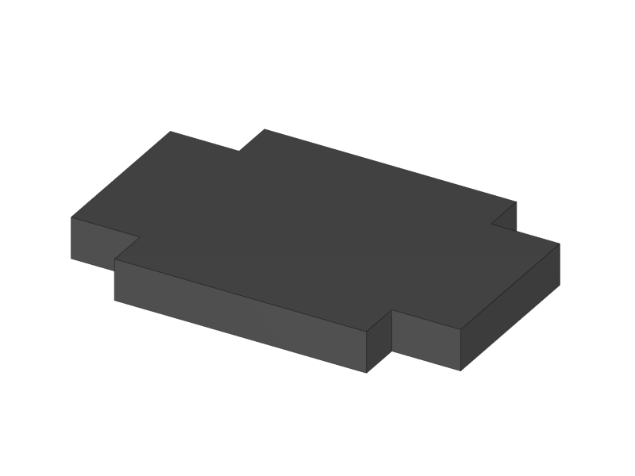
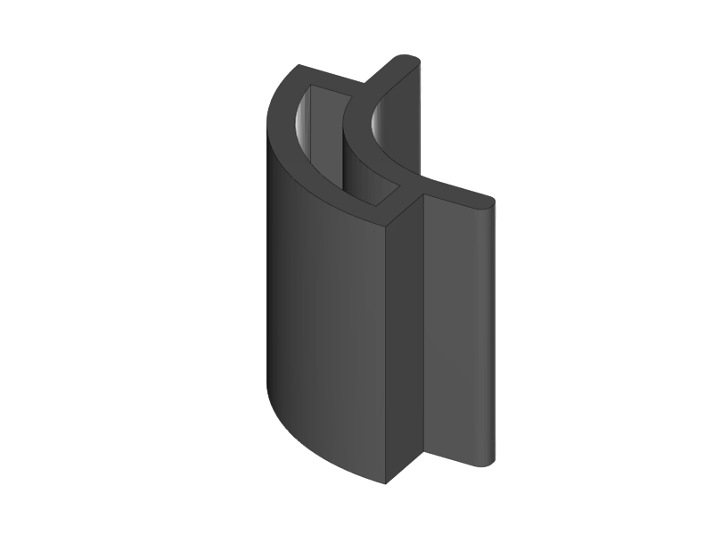
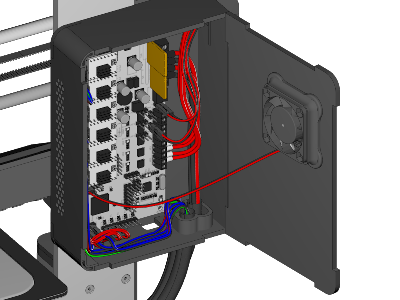
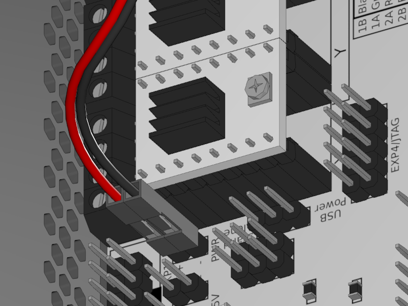
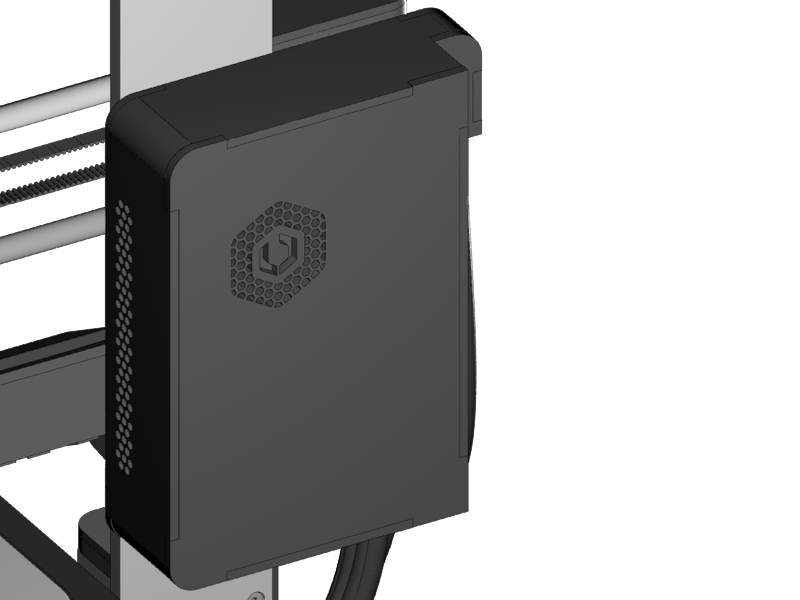
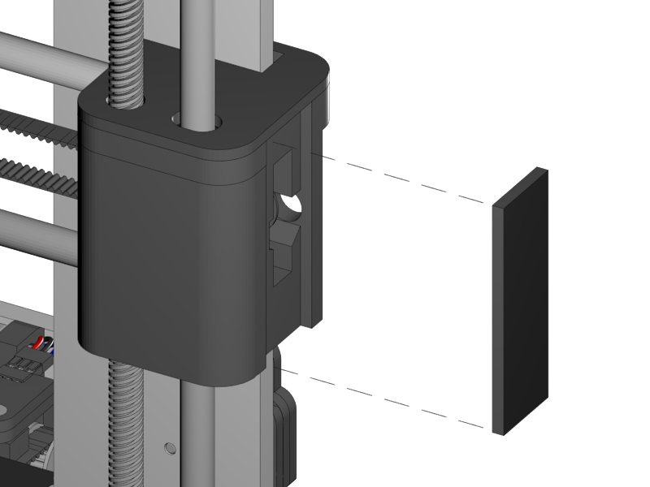
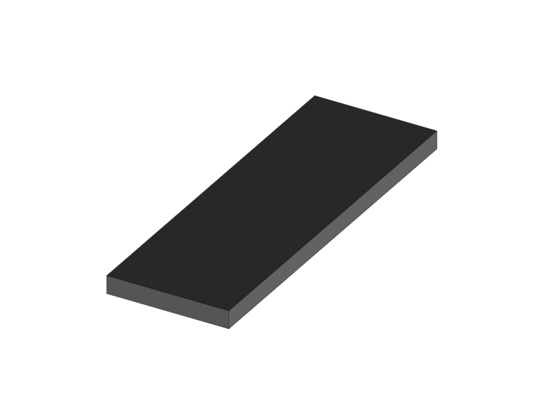

[Next](https://github.com/open3dengineering/i3_Berlin/wiki/Section-5.2-Calibrating-the-Y-Axis)

You have almost finished building your printer. Now we will test if all the connections are correct.

**Testing Temperature**

-   Turn on the printer. Check if the fans on the side of the hotends are working.

-   In the display menu push the button once and navigate to: *&gt;Prepare &gt;Preheat PLA &gt;Preheat PLA All* or if you have a single extruder *&gt;Preheat PLA 1*

-   Wait until the menu jumps back to the info screen and check if the temperatures of the nozzles and the heatbed are rising.

    -   You don’t have to wait until the temperature reaches it’s goal value.

-   In the mean time navigate to: *&gt;Control &gt;Temperature &gt;Fan Speed* and turn it up to 255 and confirm with a push on the button. The active fan on the back of the extruder should turn on now.

-   Load some filament by navigating to *&gt;Utilities &gt;Load Extruder0*

    -   The left extruder will heat up automatically now, once it’s hot the filament pulley will start turning.

    -   Put in some filament until some is extruded.

    -   Push the button to stop.

    -   If the filament pulley turns the wrong direction turn around the connector on the RUMBA board.

-   Do the same for the right extruder with *&gt;Utilities &gt;Load Ext. 1*

**Testing Motion**

-   Turn on the printer. In the display menu navigate to: *&gt;Prepare &gt;Move Axis &gt;Move 10 mm &gt;Move X* and turn the knob some steps in clockwise direction. The printhead should now move to the right.

    -   If the printhead moves to the left you should turn the connector by 180° on the RUMBA.

-   Do the same for the Y-Axis. The print platform should move to the front.

-   The same for the Z-Axis. Choose *&gt;Move 1mm* instead of *&gt;Move 10mm* in the Move Axis menu. The X-Bridge should move up.

    -   Note the printer will refuse to move in a negative direction as long as it hasn’t detected the endstops.

-   Test the endstops again by manually moving the axis to it.

    -   To move the axis by hand navigate to *&gt;Prepare &gt;Disable Steppers*. This will set the motors free.

-   If you are sure that all the endstops work navigate to *&gt;Prepare &gt;Auto Home* the printer will now home all axes.

    -   Keep your finger at the power switch when you do this for the first time. If the Z-Axis fails to detect the endstop the motors can potentially destroy some parts of the printer.

-   If everything worked correctly your printer works. Next is some simple mechanical adjustments.

<table>
<colgroup>
<col width="50%" />
<col width="50%" />
</colgroup>
<tbody>
<tr class="odd">
<td align="left">

</td>
<td align="left">
 
 1x RUMBA Case Inlet Side
</td>
</tr>
<tr class="even">
<td align="left">
 
 1x RUMBA Case Small Corner
</td>
</tr>
</tbody>
</table>

<table>
<colgroup>
<col width="50%" />
<col width="50%" />
</colgroup>
<tbody>
<tr class="odd">
<td align="left">

</td>
<td align="left">
 
 Fan Connection
</td>
</tr>
<tr class="even">
<td align="left">
 
 Closed RUMBA Case
</td>
</tr>
</tbody>
</table>

<table>
<colgroup>
<col width="50%" />
<col width="50%" />
</colgroup>
<tbody>
<tr class="odd">
<td align="left">

</td>
<td align="left">
 
 1x X-Idler Cover
</td>
</tr>
</tbody>
</table>

[Next](https://github.com/open3dengineering/i3_Berlin/wiki/Section-5.2-Calibrating-the-Y-Axis)
