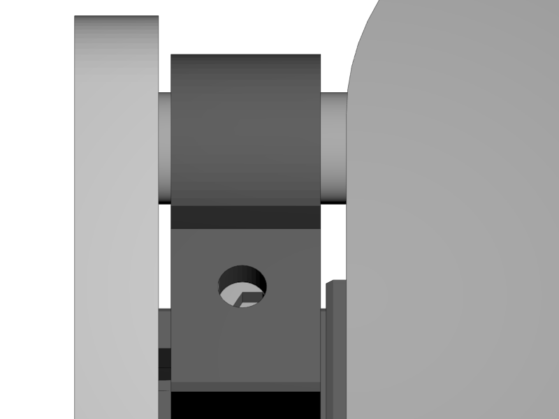

[Next](https://github.com/open3dengineering/i3_Berlin/wiki/Section-5.3-Calibrate-the-X-Axis)

<table>
<colgroup>
<col width="100%" />
</colgroup>
<tbody>
<tr class="odd">
<td align="left">

</td>
</tr>
</tbody>
</table>

-   Slide the y-carriage all the way to the back.

-   Put the mirror up side down on the smoothrods.

-   Tap the diagonally opposing corners and see if they make sound
    ticking on the smooth rods.

-   If so, the rods of the Y-Axis are not parallel and you need
    adjust it.

    -   Do so by turning the screw of the Y-Height adjuster up or down.

    -   Adjust it until the rods are parallel to the mirror.

<table>
<colgroup>
<col width="100%" />
</colgroup>
<tbody>
<tr class="odd">
<td align="left">

</td>
</tr>
</tbody>
</table>

[Next](https://github.com/open3dengineering/i3_Berlin/wiki/Section-5.3-Calibrate-the-X-Axis)
