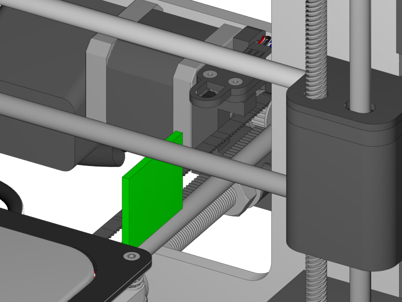
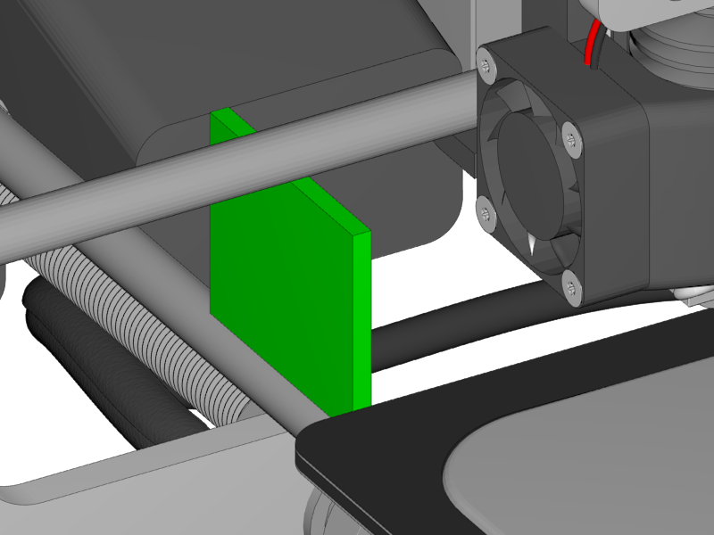

[Next](https://github.com/laydrop/i3-Berlin/wiki/Section-5.4-Calibrating-the-Print-Platform)

<table>
<colgroup>
<col width="100%" />
</colgroup>
<tbody>
<tr class="odd">
<td align="left">

</td>
</tr>
</tbody>
</table>

-   The X Bridge needs to be parallel to the Y-Rods.

-   Do so by putting any object on the right Y-Smooth Rod, turn the right motor spindle down by hand until it just touches the object.

-   Do the same on the left side until both sides are equal.

<table>
<colgroup>
<col width="100%" />
</colgroup>
<tbody>
<tr class="odd">
<td align="left">

</td>
</tr>
</tbody>
</table>

-   This calibration should be repeated after transport and or once a week or so. Do make the Y-Rods parallel first.

[Next](https://github.com/laydrop/i3-Berlin/wiki/Section-5.4-Calibrating-the-Print-Platform)
