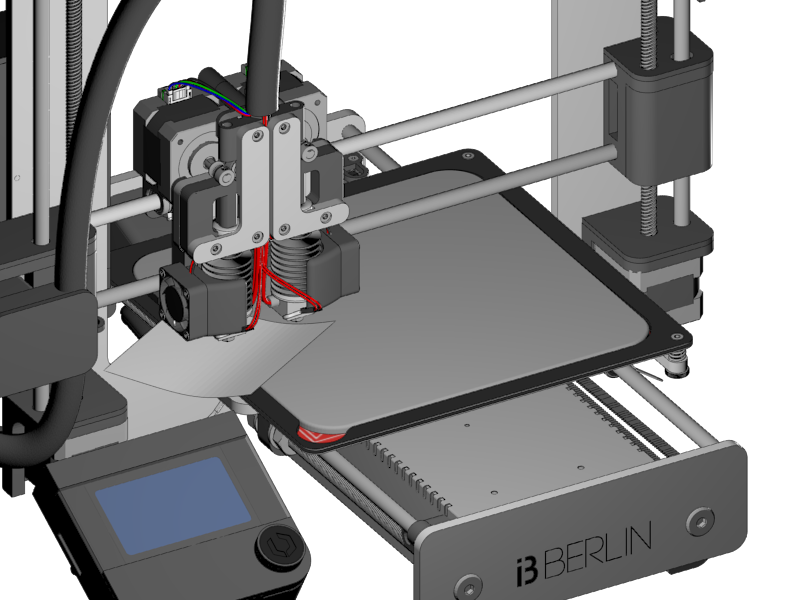
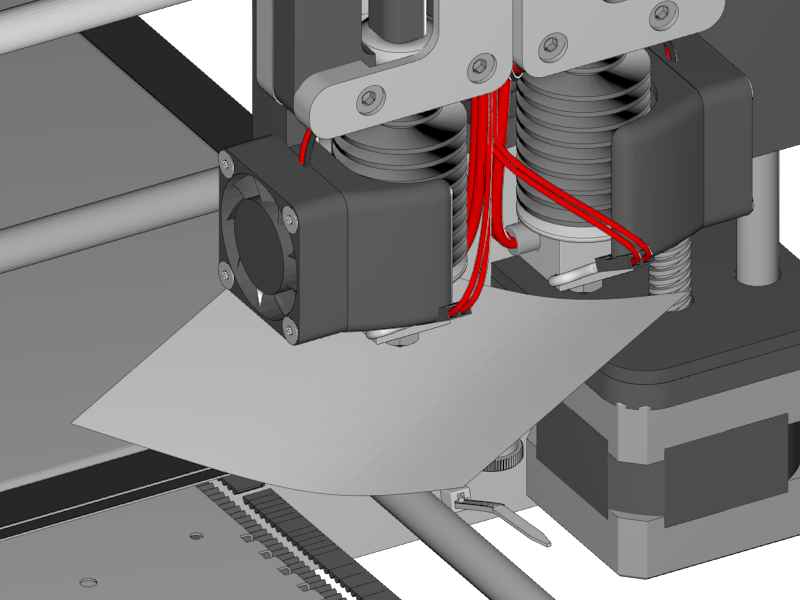
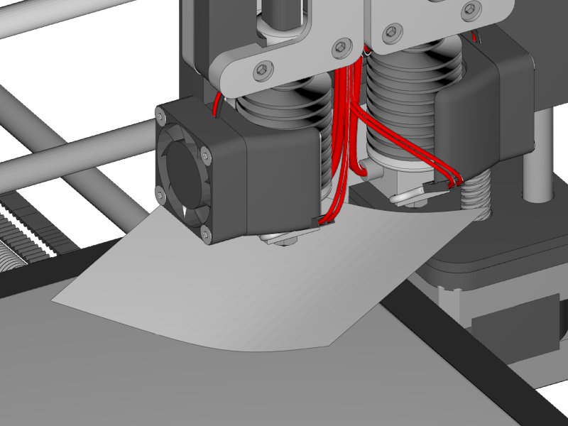
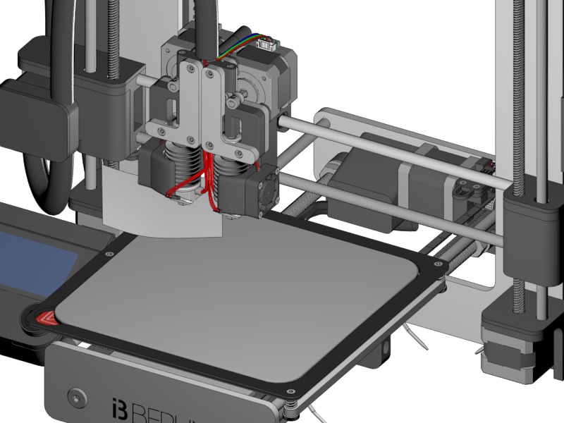
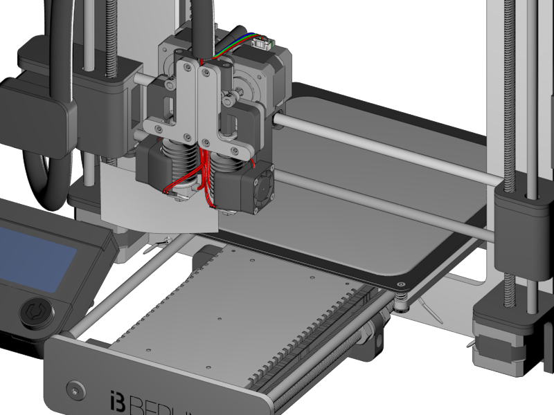

[Next](https://github.com/open3dengineering/i3_Berlin/wiki/Section-6-Printing)

-   The mirror should be well adjusted to the nozzle.

-   Turn the adjust nuts about 1cm height.

-   First home. Disable the steppers. Move the nozzle above the heatbed by hand.

-   If the nozzle is (for example) about 5mm above the heatbed, put the Z-Endstop about 4mm down.

-   Home again until the nozzle is about 1mm above the mirror.

-   Move the printbed and nozzle in the position close to the left adjusting point

<table>
<colgroup>
<col width="100%" />
</colgroup>
<tbody>
<tr class="odd">
<td align="left">

</td>
</tr>
</tbody>
</table>

-   Put a piece of paper under the nozzle

    -   I there is some plastic drip under the nozzle caused by previous prints, heat up the nozzle to printing temperature.

-   Turn the bed up (clock wise direction looking from the top) until the nozzle just grabs the paper. You can feel friction between the nozzle and the heatbed when you pull the paper, but your still capable to push the paper easily.

<table>
<colgroup>
<col width="100%" />
</colgroup>
<tbody>
<tr class="odd">
<td align="left">

</td>
</tr>
</tbody>
</table>

-   Move the nozzle to the front right position. Keep the paper underneath the nozzle while moving to prevent scratches.

-   Adjust the height of the platform until the paper touches just right

<table>
<colgroup>
<col width="100%" />
</colgroup>
<tbody>
<tr class="odd">
<td align="left">

</td>
</tr>
</tbody>
</table>

-   Move the nozzle to the right back position. Keep the paper underneath the nozzle while moving to prevent scratches.

-   Adjust the height of the platform until the paper touches just right.

-   Repeat the adjust of the 3 points until they are all perfectly adjusted.

<table>
<colgroup>
<col width="100%" />
</colgroup>
<tbody>
<tr class="odd">
<td align="left">

</td>
</tr>
</tbody>
</table>

-   As a last check up check the front and back left corner. If there is a big difference you should repeat [Calibrating the Y-Axis](https://github.com/open3dengineering/i3_Berlin/wiki/Section-5.2-Calibrating-the-Y-Axis) again or try to solve it with the paper trick.

<table>
<colgroup>
<col width="100%" />
</colgroup>
<tbody>
<tr class="odd">
<td align="left">

</td>
</tr>
</tbody>
</table>

-   This calibration should be best done before every print.

[Next](https://github.com/open3dengineering/i3_Berlin/wiki/Section-6-Printing)
